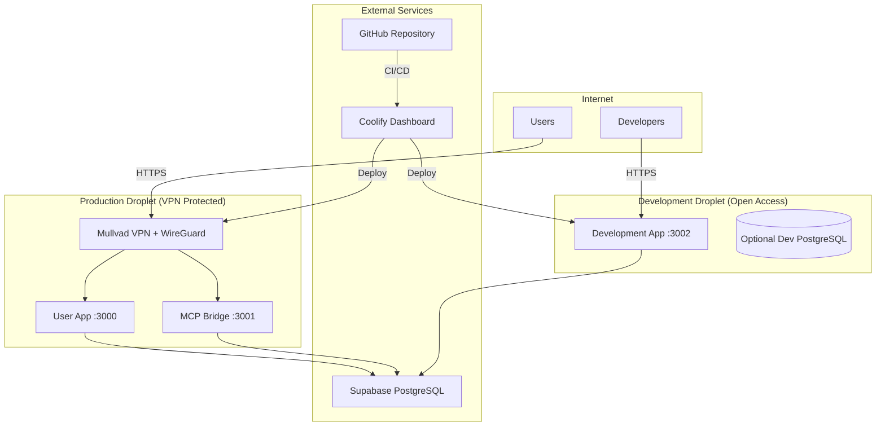

# 🚀 MET2.4 Complete Deployment Guide
## GitHub → Coolify → DigitalOcean Dual-Droplet Architecture

> **Optimal Architecture**: Production services (User App + MCP Bridge) on VPN-protected droplet, Development app on separate open-access droplet.

---

## 📋 Table of Contents

1. [Architecture Overview](#-architecture-overview)
2. [Prerequisites](#-prerequisites)
3. [DigitalOcean Setup](#-digitalocean-setup)
4. [Mullvad VPN Configuration](#-mullvad-vpn-configuration)
5. [Coolify Configuration](#-coolify-configuration)
6. [GitHub Actions Setup](#-github-actions-setup)
7. [Deployment Process](#-deployment-process)
8. [Monitoring & Maintenance](#-monitoring--maintenance)
9. [Troubleshooting](#-troubleshooting)

---

## 🏗️ Architecture Overview

### Dual-Droplet Design



### Why This Architecture?

**Security Benefits:**
- ✅ Production services behind VPN (Mullvad + WireGuard)
- ✅ Development accessible without VPN complexity
- ✅ Complete traffic isolation between environments
- ✅ Kill switch protection if VPN fails

**Performance Benefits:**
- ✅ User App + MCP Bridge co-located (low latency)
- ✅ Development environment independent scaling
- ✅ Optimized resource allocation per environment

**Cost Benefits:**
- ✅ Production: 4GB RAM (€24/month) for critical services
- ✅ Development: 2GB RAM (€12/month) for testing
- ✅ Total: ~€36/month vs single 8GB droplet at €48/month

---

## 🔧 Prerequisites

### Required Accounts
- [ ] **DigitalOcean Account** with $50+ balance
- [ ] **Mullvad VPN Account** (€5/month)
- [ ] **GitHub Repository** with Actions enabled
- [ ] **Coolify Account** (self-hosted or cloud)
- [ ] **Domain Name** with DNS management

### Required Tools
```bash
# Install DigitalOcean CLI
brew install doctl

# Install WireGuard tools
brew install wireguard-tools

# Authenticate with DigitalOcean
doctl auth init
```

### Required Secrets
Prepare these values for later configuration:

```bash
# Supabase Configuration
REACT_APP_SUPABASE_URL="https://your-project.supabase.co"
REACT_APP_SUPABASE_ANON_KEY="your-anon-key"
SUPABASE_SERVICE_ROLE_KEY="your-service-role-key"

# Domain Configuration  
DO_DOMAIN="your-domain.com"
DEV_DOMAIN="dev.your-domain.com"

# Mullvad VPN
MULLVAD_ACCOUNT="your-account-number"

# API Keys
MCP_API_KEY="generate-random-32-chars"
DEV_API_KEY="generate-random-32-chars"
```

---

## 🌊 DigitalOcean Setup

### 1. Automated Droplet Provisioning

The included script automates the entire setup:

```bash
# Make scripts executable
chmod +x scripts/provision-dual-droplets.sh
chmod +x scripts/setup-mullvad-vpn.sh

# Provision both droplets
./scripts/provision-dual-droplets.sh your-domain.com
```

This creates:
- **Production Droplet**: 4GB RAM, 2vCPUs, Ubuntu 22.04
- **Development Droplet**: 2GB RAM, 1vCPU, Ubuntu 22.04
- **SSH Keys**: Configured for secure access
- **Firewall**: Properly configured for each environment
- **Docker**: Installed and ready
- **Coolify Agents**: Installed for deployment

### 2. Manual DNS Configuration

After droplet creation, configure these DNS records:

```dns
# Production (VPN Protected)
A     your-domain.com        -> PRODUCTION_IP
A     mcp.your-domain.com    -> PRODUCTION_IP

# Development (Open Access)  
A     dev.your-domain.com    -> DEVELOPMENT_IP
```

Wait for DNS propagation (5-60 minutes) before proceeding.

---

## 🔐 Mullvad VPN Configuration

### 1. Automated VPN Setup

SSH into your production droplet and run:

```bash
# SSH into production droplet
ssh -i ~/.ssh/id_rsa_met24 root@PRODUCTION_IP

# Set your Mullvad account
export MULLVAD_ACCOUNT="your-account-number"

# Run VPN configuration script
./scripts/setup-mullvad-vpn.sh
```

This configures:
- ✅ WireGuard keys generation
- ✅ Mullvad API registration
- ✅ Amsterdam server selection (closest to Netherlands)
- ✅ Kill switch protection
- ✅ Docker VPN integration
- ✅ Monitoring service (checks every 2 minutes)

### 2. Verify VPN Connection

```bash
# Check VPN status
systemctl status wg-quick@wg0

# Verify Mullvad connection
curl -s "https://api.mullvad.net/www/am-i-mullvad/"

# Should return: "You are connected to Mullvad (server information)"
```

### 3. VPN Monitoring

The setup includes automatic monitoring:
- **Health Checks**: Every 2 minutes via systemd timer
- **Auto Recovery**: Restarts VPN if connection fails
- **Kill Switch**: Blocks all traffic if VPN is down
- **Docker Integration**: Stops services if VPN fails

---

## 🚀 Coolify Configuration

### 1. Add Servers to Coolify

1. **Login to Coolify Dashboard**
2. **Navigate to Servers**
3. **Add Production Server**:
   - Name: `MET24-Production`
   - IP: `PRODUCTION_IP`
   - SSH Key: Upload `~/.ssh/id_rsa_met24`
   - Description: `VPN-protected production services`

4. **Add Development Server**:
   - Name: `MET24-Development`  
   - IP: `DEVELOPMENT_IP`
   - SSH Key: Upload `~/.ssh/id_rsa_met24`
   - Description: `Open-access development environment`

### 2. Create Production Project

1. **Create New Project**: `MET24-Production`
2. **Add Application**:
   - **Type**: Docker Compose
   - **Git Repository**: `https://github.com/your-username/MET2.4`
   - **Branch**: `main`
   - **Compose File**: `docker-compose.production.yml`
   - **Server**: `MET24-Production`

3. **Environment Variables**:
```env
NODE_ENV=production
REACT_APP_SUPABASE_URL=https://your-project.supabase.co
REACT_APP_SUPABASE_ANON_KEY=your-anon-key
SUPABASE_SERVICE_ROLE_KEY=your-service-role-key
DO_DOMAIN=your-domain.com
MCP_API_KEY=your-mcp-api-key
VPN_PROTECTED=true
MULLVAD_ACCOUNT=your-account-number
WG_PRIVATE_KEY=your-wireguard-private-key
```

4. **Domain Configuration**:
   - **User App**: `your-domain.com` → Port 3000
   - **MCP Bridge**: `mcp.your-domain.com` → Port 3001
   - **SSL**: Enable Let's Encrypt

### 3. Create Development Project

1. **Create New Project**: `MET24-Development`
2. **Add Application**:
   - **Type**: Docker Compose
   - **Git Repository**: `https://github.com/your-username/MET2.4`
   - **Branch**: `develop`
   - **Compose File**: `docker-compose.development.yml`
   - **Server**: `MET24-Development`

3. **Environment Variables**:
```env
NODE_ENV=development
DEV_DOMAIN=dev.your-domain.com
DEV_API_KEY=your-dev-api-key
DEV_DB_PASSWORD=secure-dev-password
REACT_APP_SUPABASE_URL=https://your-project.supabase.co
REACT_APP_SUPABASE_ANON_KEY=your-anon-key
VPN_PROTECTED=false
DEVELOPMENT_MODE=true
HOT_RELOAD=true
```

4. **Domain Configuration**:
   - **Dev App**: `dev.your-domain.com` → Port 3002
   - **SSL**: Enable Let's Encrypt

### 4. Generate Webhook URLs

For each project, copy the webhook URL from Coolify dashboard:
- **Production Webhook**: `https://coolify.yourdomain.com/webhooks/...production...`
- **Development Webhook**: `https://coolify.yourdomain.com/webhooks/...development...`

---

## 🔧 GitHub Actions Setup

### 1. Repository Secrets

Add these secrets to your GitHub repository (`Settings > Secrets and variables > Actions`):

```bash
# Supabase
REACT_APP_SUPABASE_URL
REACT_APP_SUPABASE_ANON_KEY  
SUPABASE_SERVICE_ROLE_KEY

# Domains
DO_DOMAIN                    # your-domain.com
DEV_DOMAIN                   # dev.your-domain.com

# Coolify Webhooks
COOLIFY_PRODUCTION_WEBHOOK_URL
COOLIFY_DEVELOPMENT_WEBHOOK_URL
COOLIFY_API_TOKEN

# VPN Configuration
MULLVAD_ACCOUNT
WG_PRIVATE_KEY

# API Keys
MCP_API_KEY
DEV_API_KEY
DEV_DB_PASSWORD
```

### 2. Workflow Configuration

The included workflow (`.github/workflows/deploy-dual-droplets.yml`) provides:

- ✅ **Automated Testing**: Lint, type-check, unit tests
- ✅ **Security Scanning**: Trivy vulnerability scanner
- ✅ **Branch-based Deployment**: 
  - `main` branch → Production droplet
  - `develop` branch → Development droplet
- ✅ **Health Checks**: Verify services after deployment
- ✅ **VPN Verification**: Ensure VPN protection is active

### 3. Deployment Triggers

**Production Deployment:**
```bash
git checkout main
git commit -m "Production update"
git push origin main
# → Triggers production deployment with VPN protection
```

**Development Deployment:**
```bash
git checkout develop  
git commit -m "Feature update"
git push origin develop
# → Triggers development deployment with open access
```

---

## 🚀 Deployment Process

### Initial Deployment

1. **Push to GitHub**:
```bash
# Ensure you're on main branch for production
git checkout main
git push origin main
```

2. **Monitor GitHub Actions**:
   - Watch the workflow in `Actions` tab
   - Verify all steps complete successfully
   - Check deployment notifications

3. **Verify Services**:
```bash
# Production services (via VPN)
curl -f https://your-domain.com/health
curl -f https://mcp.your-domain.com/health

# Development services (direct access)
curl -f https://dev.your-domain.com/health
```

### Ongoing Deployments

**Quick Deploy Scripts:**
```bash
# Deploy production
npm run deploy:coolify:prod

# Deploy development  
npm run deploy:coolify:dev

# View logs
npm run logs:prod
npm run logs:dev
```

---

## 📊 Monitoring & Maintenance

### 1. Health Monitoring

**Automated Health Checks:**
```bash
# Check all services
npm run health:prod
npm run health:dev

# Individual service checks
curl -f https://your-domain.com/health
curl -f https://mcp.your-domain.com/health  
curl -f https://dev.your-domain.com/health
```

**VPN Monitoring:**
- Automatic monitoring every 2 minutes
- Logs in `/var/log/vpn-monitor.log`
- Auto-restart on connection failure
- Kill switch if VPN fails

### 2. Log Management

**Production Logs:**
```bash
# SSH into production droplet
ssh -i ~/.ssh/id_rsa_met24 root@PRODUCTION_IP

# View application logs
docker-compose -f /opt/met24/docker-compose.production.yml logs -f

# View VPN logs
tail -f /var/log/vpn-monitor.log

# View system logs
journalctl -u wg-quick@wg0 -f
```

**Development Logs:**
```bash
# SSH into development droplet
ssh -i ~/.ssh/id_rsa_met24 root@DEVELOPMENT_IP

# View application logs
docker-compose -f /opt/met24/docker-compose.development.yml logs -f
```

### 3. Performance Monitoring

**Resource Usage:**
```bash
# Check droplet resources
doctl compute droplet list
htop  # on each droplet

# Check Docker resources
docker stats

# Check disk usage
df -h
docker system df
```

**Database Monitoring:**
- Supabase dashboard provides comprehensive metrics
- Query performance tracking
- Connection pool monitoring

---

## 🔧 Troubleshooting

### Common Issues

**VPN Connection Issues:**
```bash
# Check VPN status
systemctl status wg-quick@wg0

# Restart VPN
systemctl restart wg-quick@wg0

# Check Mullvad connectivity
curl -s "https://api.mullvad.net/www/am-i-mullvad/"

# View VPN logs
journalctl -u wg-quick@wg0 -n 50
```

**Application Deployment Issues:**
```bash
# Check Coolify deployment logs
# (via Coolify dashboard)

# Check Docker container status
docker ps -a

# Restart services
docker-compose -f docker-compose.production.yml restart

# Check service logs
docker logs met24-user-app
docker logs met24-mcp-bridge
```

**DNS and SSL Issues:**
```bash
# Test DNS resolution
dig your-domain.com
dig mcp.your-domain.com
dig dev.your-domain.com

# Check SSL certificates
curl -vI https://your-domain.com

# Renew SSL certificates (Coolify handles this automatically)
```

**Database Connection Issues:**
```bash
# Test Supabase connectivity
curl -f "https://your-project.supabase.co/rest/v1/" \
  -H "apikey: your-anon-key"

# Check environment variables
env | grep SUPABASE

# Test from within containers
docker exec met24-user-app curl -f "$REACT_APP_SUPABASE_URL/rest/v1/"
```

### Emergency Procedures

**VPN Failure (Kill Switch Activated):**
1. SSH into production droplet
2. Check VPN status: `systemctl status wg-quick@wg0`
3. Restart VPN: `systemctl restart wg-quick@wg0`
4. If persistent issues, check Mullvad account status
5. Restart Docker services: `docker-compose restart`

**Production Service Outage:**
1. Check GitHub Actions for failed deployments
2. SSH into production droplet
3. Check Docker services: `docker ps -a`
4. View logs: `docker logs met24-user-app`
5. Rollback if needed: Re-deploy previous working commit

**Development Service Issues:**
1. Development downtime doesn't affect production
2. Restart development services: `docker-compose restart`
3. Check for resource limits: `htop`, `df -h`
4. Scale up droplet if needed: `doctl compute droplet resize`

---

## 📈 Performance Optimization

### Resource Allocation

**Production Droplet (4GB RAM):**
- User App: 1.5GB RAM allocation
- MCP Bridge: 1GB RAM allocation  
- VPN & System: 1.5GB RAM allocation
- **Scaling**: Monitor via `htop`, scale to 8GB if needed

**Development Droplet (2GB RAM):**
- Development App: 1GB RAM allocation
- System & Tools: 1GB RAM allocation
- **Scaling**: Perfect for development workloads

### Caching Strategy

**Browser Caching:**
- Static assets: 1 year cache
- API responses: 5 minutes cache
- PWA assets: Service worker caching

**Database Optimization:**
- Supabase connection pooling
- Query optimization via indexes
- Real-time subscriptions for live data

### CDN Integration

Consider adding Cloudflare for:
- Global CDN distribution
- DDoS protection  
- SSL termination
- Additional security layer

---

## 💰 Cost Analysis

### Monthly Costs

| Component | Cost | Purpose |
|-----------|------|---------|
| Production Droplet (4GB) | €24/month | User App + MCP Bridge |
| Development Droplet (2GB) | €12/month | Development environment |
| Mullvad VPN | €5/month | Production security |
| Domain + DNS | €10/year | Custom domain |
| **Total** | **€41/month** | Complete infrastructure |

### Cost Optimization Tips

1. **Right-size Resources**: Monitor usage and scale accordingly
2. **Development Efficiency**: Use snapshots for rapid environment recreation
3. **Backup Strategy**: Automated backups to DigitalOcean Spaces
4. **Monitoring**: Set up alerts to prevent resource overruns

---

## 🎯 Next Steps

### Production Readiness
- [ ] SSL certificates configured and auto-renewing
- [ ] VPN connection stable and monitored
- [ ] All health checks passing
- [ ] DNS propagation complete
- [ ] GitHub Actions workflow successful

### Advanced Features
- [ ] **Backup Strategy**: Automated database backups
- [ ] **Monitoring Dashboard**: Grafana + Prometheus setup
- [ ] **Error Tracking**: Sentry integration
- [ ] **Performance Monitoring**: Application performance monitoring
- [ ] **Load Testing**: Ensure scalability under load

### Security Enhancements
- [ ] **WAF Setup**: Web Application Firewall via Cloudflare
- [ ] **Security Headers**: HSTS, CSP, etc.
- [ ] **Intrusion Detection**: Monitor for suspicious activity
- [ ] **Regular Updates**: Automated security patches

---

## 🆘 Support

For issues with this deployment:

1. **Check GitHub Issues**: Common problems and solutions
2. **Review Logs**: Application and system logs for errors
3. **Monitor Resources**: Ensure adequate resources available
4. **VPN Status**: Verify Mullvad VPN connectivity
5. **DNS Resolution**: Confirm domains resolve correctly

**Emergency Contacts:**
- Mullvad Support: For VPN connectivity issues
- DigitalOcean Support: For droplet and infrastructure issues  
- Supabase Support: For database connectivity issues

---

*This deployment guide ensures a production-ready, secure, and scalable MET2.4 application with optimal resource allocation and VPN protection for critical services.*