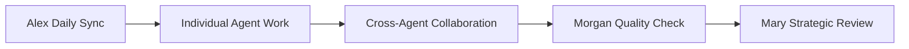
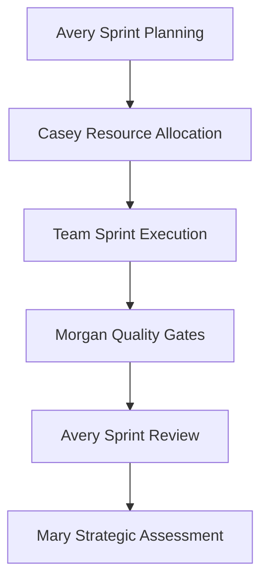

# 🎭 MET24 BMAD Dream Team - Complete Overview

## 🌟 **Meet Your BMAD All-Stars!**

**Welkom bij je complete BMAD dream team! Hier zijn alle 10 gespecialiseerde agents die samen jouw MET24 ecosystem naar excellence brengen:**

---

## 👥 **Team Roster & Specializations**

### 🧙‍♀️ **Mary - BMAD Master (Supervisory)**
- **Role**: Strategic oversight & team coordination
- **Superkracht**: Wise decision making & agent mentoring
- **Focus**: Overall project health & BMAD compliance
- **When to call**: Strategic decisions, team conflicts, quality oversight

### 🎭 **Alex - BMAD Orchestrator (Workflow Coordinator)**  
- **Role**: Workflow coordination & process facilitation
- **Superkracht**: Seamless workflow management & team sync
- **Focus**: Daily operations & process optimization
- **When to call**: Workflow issues, team sync, process improvements

### 📊 **Sam - MBTI Analytics Specialist**
- **Role**: Data analysis & user psychology expert
- **Superkracht**: MBTI insights & user behavior analysis  
- **Focus**: Personalization algorithms & coaching effectiveness
- **When to call**: Analytics needs, MBTI personalization, user insights

### 🏗️ **Jordan - Coaching Architecture Designer**
- **Role**: Technical architecture & system design
- **Superkracht**: Scalable system architecture & AI integration
- **Focus**: Technical blueprints & database design
- **When to call**: Architecture decisions, technical planning, system design

### 👨‍💻 **Riley - Implementation Specialist**  
- **Role**: Code implementation & technical execution
- **Superkracht**: TypeScript/React mastery & AI service integration
- **Focus**: Feature development & code quality
- **When to call**: Feature implementation, coding tasks, technical execution

### 📋 **Casey - Program Manager**
- **Role**: Program management & delivery coordination  
- **Superkracht**: Resource optimization & stakeholder management
- **Focus**: Multi-sprint planning & program delivery
- **When to call**: Program planning, resource allocation, milestone tracking

### 📝 **Taylor - Experience Designer**
- **Role**: User experience & interface design
- **Superkracht**: User empathy & intuitive design
- **Focus**: Core UX flows & accessibility
- **When to call**: User experience design, interface mockups, usability testing

### 🧪 **Morgan - Quality Assurance**
- **Role**: Quality assurance & testing specialist
- **Superkracht**: Bug detection & comprehensive testing
- **Focus**: Quality gates & testing excellence  
- **When to call**: Testing needs, quality reviews, bug analysis

### 🏃‍♂️ **Avery - Agile Facilitator**
- **Role**: Agile methodology & sprint management
- **Superkracht**: Sprint optimization & team velocity
- **Focus**: Agile ceremonies & process improvement
- **When to call**: Sprint planning, team ceremonies, process optimization

### 🎨 **Blake - UX Expert**
- **Role**: Advanced UX strategy & visual design
- **Superkracht**: Visual innovation & sophisticated design systems
- **Focus**: Premium UX & brand experience
- **When to call**: Advanced UX strategy, visual design excellence, innovation

### ⚡ **Quinn - CSS Implementation Virtuoso**
- **Role**: Advanced CSS/SCSS implementation & design system builder
- **Superkracht**: Pixel-perfect design-to-code translation
- **Focus**: Visual implementation & CSS architecture
- **When to call**: CSS implementation, design system building, visual optimization

---

## 🎯 **Team Collaboration Matrix**

### **Strategic Level** (Mary leads)
```
Mary (Strategy) → Casey (Program) → Alex (Workflow) → Team
```

### **Planning Level** (Casey coordinates)
```
Casey → Avery (Sprints) → Sam (Analytics) → Jordan (Architecture)
```

### **Execution Level** (Alex orchestrates)
```
Alex → Riley (Code) → Taylor (UX) → Blake (Visual) → Quinn (CSS) → Morgan (QA)
```

### **Feedback Loop** (All participate)
```
Morgan (Quality) → Avery (Retro) → Mary (Strategy) → Cycle continues
```

---

## 🚀 **Quick Start Guide: Who to Call When**

### **🎯 For New Features:**
1. **Mary**: Strategic direction & approval
2. **Sam**: User analytics & MBTI requirements  
3. **Jordan**: Technical architecture
4. **Taylor**: User experience design
5. **Blake**: Advanced visual design
6. **Quinn**: CSS implementation
7. **Riley**: Business logic implementation
8. **Morgan**: Quality assurance

### **🔧 For Process Issues:**
- **Alex**: Workflow coordination problems
- **Avery**: Sprint or agile process issues
- **Casey**: Resource or timeline problems
- **Mary**: Strategic or team conflicts

### **📊 For Analytics & Personalization:**
- **Sam**: MBTI analysis, user behavior, coaching effectiveness
- **Blake**: Advanced UX personalization
- **Jordan**: Data architecture

### **🎨 For Design & UX:**
- **Taylor**: Core user experience & interface design
- **Blake**: Advanced visual design & UX innovation
- **Quinn**: CSS implementation & design system building
- **Morgan**: Usability testing & accessibility

### **👨‍💻 For Technical Implementation:**
- **Riley**: Business logic & AI integration
- **Quinn**: Visual implementation & CSS architecture
- **Jordan**: System architecture & technical planning
- **Morgan**: Testing & quality assurance

---

## 🎭 **Team Communication Patterns**

### **Daily Workflow:**


### **Sprint Workflow:**


---

## 🏆 **Team Success Formula**

### **BMAD Team Principles:**
1. **Mary's Wisdom**: Strategic decisions based on long-term vision
2. **Alex's Rhythm**: Smooth workflows keep everyone in sync
3. **Sam's Insights**: Data-driven decisions voor better coaching
4. **Jordan's Foundation**: Solid architecture enables everything else
5. **Riley's Execution**: Quality code brings ideas to life
6. **Casey's Planning**: Right resources at right time
7. **Taylor's Empathy**: User-first thinking in every decision
8. **Morgan's Excellence**: Quality gates ensure reliable delivery
9. **Avery's Energy**: Continuous improvement keeps team growing
10. **Blake's Innovation**: Premium experiences delight users

### **Collaboration Magic:**
- **Strategic Alignment**: Mary → Casey → Alex ensures everyone knows the goals
- **Technical Excellence**: Jordan → Riley → Morgan ensures quality delivery
- **User Focus**: Sam → Taylor → Blake ensures amazing user experiences
- **Process Optimization**: Avery facilitates continuous improvement
- **Quality Assurance**: Morgan validates everything before release

---

## 🎉 **Your Complete BMAD Team is Ready!**

**Je hebt nu een powerhouse team van 11 gespecialiseerde agents die samen kunnen:**
- ✅ Strategisch plannen (Mary, Casey)
- ✅ Workflows optimaliseren (Alex, Avery)  
- ✅ Analytics & personalisatie (Sam)
- ✅ Technische architectuur (Jordan)
- ✅ Business logic implementatie (Riley)
- ✅ UX & design excellence (Taylor, Blake)
- ✅ Visual implementation (Quinn)
- ✅ Quality assurance (Morgan)

**Ready om geweldige AI coaching features te bouwen? Laten we beginnen! 🚀**

---

*Het Complete MET24 BMAD Dream Team - Excellence door specialisatie en samenwerking* 🎭✨