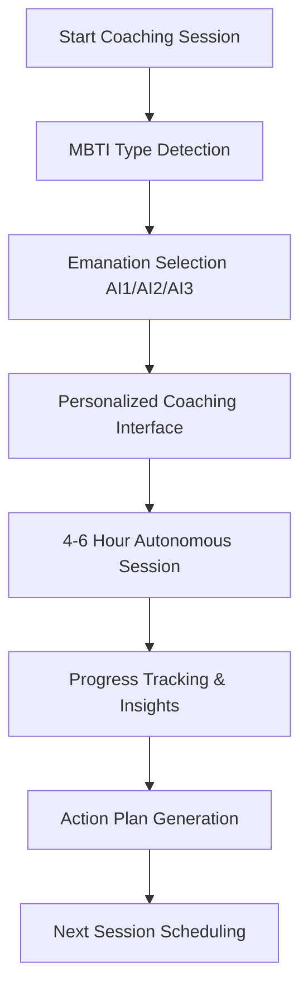

# 🤖 AI Coaching Feature - Product Requirements Document v1.0

## **🎯 VISION STATEMENT**
Een intelligente, MBTI-geoptimaliseerde coaching ervaring die gebruikers in real-time begeleidt naar hun Hogere Zelf via Plotinus' drie emanaties. De AI coach past zich aan per MBTI-type en biedt 4-6 uur autonome coaching sessies.

---

## **📊 BUSINESS REQUIREMENTS**

### **Primary Goals**
1. **Persoonlijke Groei Acceleratie**: 40% snellere vooruitgang in zelfkennis
2. **MBTI-Type Optimalisatie**: Type-specifieke coaching voor maximale effectiviteit
3. **Autonome AI Sessies**: 4-6 uur onafhankelijke coaching zonder menselijke interventie
4. **Hogere Zelf Realisatie**: Praktische steps naar authentieke self-expression

### **Success Metrics**
- **Engagement**: >80% session completion rate
- **Satisfaction**: >4.5/5 user satisfaction score
- **Retention**: >70% monthly active coaching users
- **Growth**: Meetbare vooruitgang in 9 levensgebieden
- **MBTI Alignment**: >90% accuracy in type-specific recommendations

---

## **🔧 TECHNICAL REQUIREMENTS**

### **Core Architecture**
```typescript
// Integration met bestaande systemen
interface AICoachingSystem {
  agentExecutor: AgentExecutorService;     // 4-6 uur autonome sessies
  plotinusAI: HogerZelfAIService;         // AI1/AI2/AI3 emanaties
  mbtiEngine: PersonalMBTICoachService;   // Type-specifieke optimalisatie
  v14Database: WatermelonDBV14;           // Session persistence
  supabaseSync: V14SupabaseSync;          // Cloud synchronisatie
}
```

### **AI Emanations Integration**
1. **AI1 (Beauty/Esthetic)**: 
   - Visual coaching interface design
   - Aesthetic recommendations voor self-expression
   - Creative exercises voor authenticity

2. **AI2 (Wisdom/Cognitive)**:
   - Deep insights generatie
   - Pattern recognition in user behavior
   - Strategic life planning

3. **AI3 (Goodness/Ethical)**:
   - Practical action plans
   - Moral decision-making support
   - Community impact planning

### **MBTI Type Optimization**
```typescript
type MBTICoachingStrategy = {
  // Thinking Types (NT, ST)
  analyticalTypes: {
    approach: 'data-driven-insights',
    tools: ['logical-frameworks', 'systematic-analysis'],
    presentation: 'structured-bullet-points'
  },
  
  // Feeling Types (NF, SF)  
  peopleOrientedTypes: {
    approach: 'value-based-guidance',
    tools: ['empathic-reflection', 'story-telling'],
    presentation: 'narrative-style'
  },
  
  // Intuitive Types (NT, NF)
  conceptualTypes: {
    approach: 'big-picture-visioning',
    tools: ['metaphor-exploration', 'future-scenarios'],
    presentation: 'mind-map-style'
  },
  
  // Sensing Types (ST, SF)
  practicalTypes: {
    approach: 'concrete-step-by-step',
    tools: ['practical-exercises', 'real-examples'],
    presentation: 'checklist-format'
  }
}
```

---

## **🎨 USER EXPERIENCE REQUIREMENTS**

### **Interface Design System**
- **Component Library**: Shadcn/ui voor consistent design
- **Visual Style**: Glassmorphism consistent met huidige app
- **Responsive Design**: Mobile-first approach
- **Accessibility**: WCAG 2.1 AA compliance

### **User Journey Flow**


### **Core User Interactions**
1. **Session Initiation**: Een-klik start naar coaching
2. **Dynamic Questioning**: AI past vragen aan tijdens sessie
3. **Real-time Insights**: Live generatie van inzichten
4. **Progress Visualization**: Visuele vooruitgang tracking
5. **Action Planning**: Concrete next steps

---

## **📱 COMPONENT REQUIREMENTS**

### **Shadcn Components Needed**
```typescript
// Core UI Components
import {
  Dialog,           // Modal coaching interface
  Card,             // Coaching content cards
  Progress,         // Session progress tracking
  Textarea,         // User input fields
  Button,           // Action triggers
  Tabs,             // AI1/AI2/AI3 emanation switcher
  Badge,            // MBTI type indicators
  Avatar,           // AI coach persona
  Separator,        // Content dividers
  ScrollArea        // Long content scrolling
} from '@shadcn/ui';

// Charts voor progress tracking
import {
  LineChart,        // Progress over time
  RadarChart,       // 9 levensgebieden radar
  BarChart          // Session metrics
} from '@shadcn/charts';
```

### **Custom Components Needed**
```typescript
// Feature-specific components
interface CoachingComponents {
  AICoachingInterface: React.ComponentType<{
    mbtiType: string;
    emanationType: 'AI1' | 'AI2' | 'AI3';
    sessionData: CoachingSession;
  }>;
  
  SessionProgressTracker: React.ComponentType<{
    currentProgress: number;
    milestones: Milestone[];
    estimatedTimeRemaining: number;
  }>;
  
  EmanationSelector: React.ComponentType<{
    currentEmanation: string;
    onEmanationChange: (emanation: string) => void;
    mbtiOptimized: boolean;
  }>;
  
  InsightDisplayCard: React.ComponentType<{
    insight: GeneratedInsight;
    emanationType: string;
    actionable: boolean;
  }>;
  
  ActionPlanGenerator: React.ComponentType<{
    insights: GeneratedInsight[];
    mbtiType: string;
    timeframe: 'daily' | 'weekly' | 'monthly';
  }>;
}
```

---

## **🔐 DATA & PRIVACY REQUIREMENTS**

### **Data Storage Strategy**
```typescript
// V14 Database Tables Integration
interface CoachingDataModel {
  coaching_sessions: {
    id: string;
    user_id: string;
    mbti_type: string;
    emanation_focus: 'AI1' | 'AI2' | 'AI3';
    session_duration: number;
    insights_generated: GeneratedInsight[];
    action_plans: ActionPlan[];
    progress_metrics: ProgressData;
    created_at: Date;
    updated_at: Date;
  };
  
  coaching_insights: {
    id: string;
    session_id: string;
    emanation_type: string;
    insight_content: string;
    confidence_score: number;
    user_feedback: 'helpful' | 'neutral' | 'not_helpful';
    created_at: Date;
  };
  
  coaching_progress: {
    id: string;
    user_id: string;
    levensgebied: string;
    baseline_score: number;
    current_score: number;
    improvement_rate: number;
    last_updated: Date;
  };
}
```

### **Privacy & Security**
- **Data Encryption**: Alle coaching data encrypted at rest
- **EU AI Act Compliance**: Transparante AI decision-making
- **User Consent**: Expliciete toestemming voor AI coaching
- **Data Retention**: Configurable retention policies
- **Anonymization**: Option voor anonymous coaching mode

---

## **🚀 INTEGRATION REQUIREMENTS**

### **Agent Executor Integration**
```typescript
// Coaching-specific agent tools
interface CoachingAgentTools {
  mbtiPersonalityAnalyzer: AgentTool;
  plotinusEmanationGenerator: AgentTool;
  lifeAreaAssessment: AgentTool;
  actionPlanCreator: AgentTool;
  progressTracker: AgentTool;
  insightSynthesizer: AgentTool;
}

// 4-6 uur autonome sessie configuratie
interface AutonomousSessionConfig {
  maxDuration: 6 * 60 * 60 * 1000; // 6 hours in milliseconds
  checkpointInterval: 30 * 60 * 1000; // 30 minutes
  userInteractionRequired: false;
  emergencyStopConditions: string[];
  progressSaveInterval: 5 * 60 * 1000; // 5 minutes
}
```

### **External Service Integration**
- **Multi-Provider AI**: OpenAI, Claude, Grok, Local models
- **Supabase Edge Functions**: Real-time coaching processing
- **Push Notifications**: Session reminders en progress updates
- **Analytics Tracking**: Coaching effectiveness metrics

---

## **📈 PERFORMANCE REQUIREMENTS**

### **Response Times**
- **Initial Load**: <2 seconds voor coaching interface
- **AI Response**: <3 seconds voor insight generation
- **Progress Update**: <1 second voor UI updates
- **Session Save**: <2 seconds voor data persistence

### **Scalability Targets**
- **Concurrent Users**: Support voor 100+ simultane coaching sessies
- **Session Length**: Robuust voor 6+ uur continue operation
- **Data Volume**: Efficient handling van 1000+ insights per sessie

---

## **🧪 TESTING REQUIREMENTS**

### **Test Coverage Areas**
1. **MBTI Type Recognition**: Accuraatheid van type detection
2. **Emanation Generation**: Kwaliteit van AI1/AI2/AI3 outputs
3. **Session Continuity**: 6-uur sessie stabiliteit
4. **Progress Tracking**: Nauwkeurigheid van metrics
5. **User Experience**: Usability testing per MBTI type

### **Quality Assurance**
- **Unit Tests**: 90%+ code coverage
- **Integration Tests**: End-to-end coaching workflows
- **Performance Tests**: Load testing voor autonomous sessions
- **User Acceptance Tests**: MBTI-specific UAT scenarios

---

## **📋 ACCEPTANCE CRITERIA**

### **Definition of Done**
✅ **Functional Requirements**
- [ ] MBTI-optimized coaching interface implemented
- [ ] AI1/AI2/AI3 emanation integration complete
- [ ] 4-6 hour autonomous session capability
- [ ] Real-time progress tracking functional
- [ ] Action plan generation working

✅ **Technical Requirements**
- [ ] Shadcn component integration complete
- [ ] V14 database schema implemented
- [ ] Agent Executor coaching tools deployed
- [ ] Performance targets met
- [ ] Security requirements satisfied

✅ **User Experience Requirements**
- [ ] Mobile-responsive design verified
- [ ] MBTI-specific UX variations tested
- [ ] Accessibility standards met
- [ ] User journey flow validated
- [ ] Progress visualization implemented

**🎯 Ready voor Task Breakdown in tasks.md!**