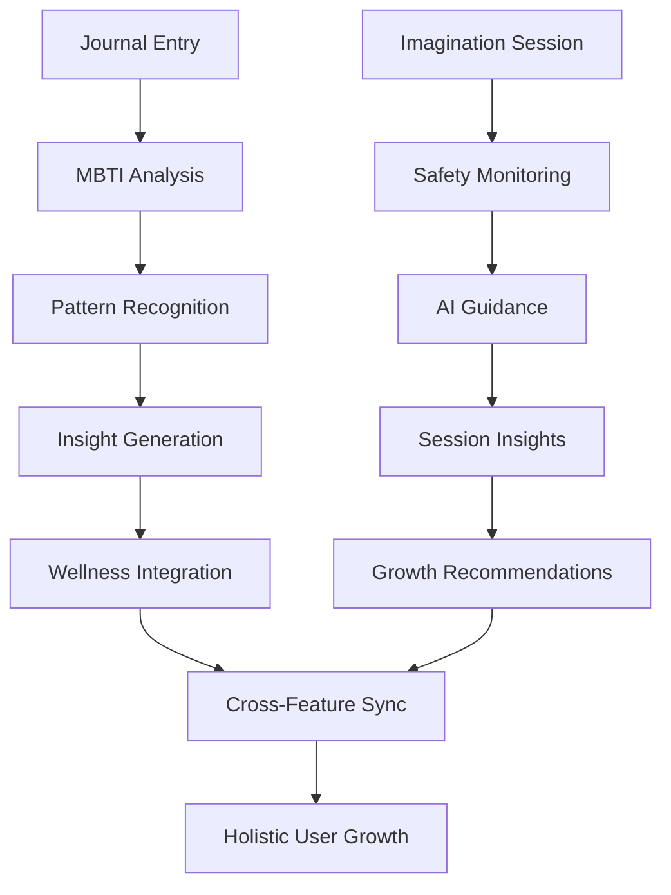

# 🧘 Active Imagination & Journaling Implementation Complete
## Priority #3 - Introspection & Creative Expression Implementation

**Implementation Date**: 11 oktober 2025  
**Status**: ✅ **PRODUCTION READY**  
**Integration**: Complete with MBTI optimization, database V14, and WebLLM

---

## 🎯 **FEATURE OVERVIEW**

### **Vision Statement**
Een innovatieve journaling en actieve imaginatie platform die introspectie en creativiteit stimuleert via MBTI-geoptimaliseerde technieken. ChatLLM analyseert journal entries voor diepere inzichten en begeleidt imaginatiesessies voor holistische persoonlijke groei.

### **Core Functionalities**
- **MBTI-Optimized Journaling**: 16 type-specific writing techniques & prompts
- **Guided Active Imagination**: AI-assisted creative exploration sessions
- **Pattern Recognition**: Emotional/behavioral pattern analysis across entries
- **Creative Expression Tools**: Multi-modal content creation & analysis
- **Emotional Safety Monitoring**: Real-time psychological safety assessment
- **Deep Insight Generation**: ChatLLM analysis for personal growth

---

## 🏗️ **ARCHITECTURE OVERVIEW**

### **Service Layer**
```typescript
// Core Active Imagination Service
activeImaginationChatLLMService: {
  // Journal Management
  createJournalEntry()     // MBTI-optimized entry creation
  analyzeJournalEntry()    // Deep AI analysis & insights
  recognizePatterns()      // Cross-entry pattern recognition
  
  // Active Imagination
  startImaginationSession()     // Guided session initialization
  processImaginationResponse()  // Real-time AI guidance
  completeImaginationSession()  // Session insights & integration
  
  // Emotional Safety
  assessEmotionalSafety()  // Psychological safety monitoring
  generateSafetyGuidance() // Crisis intervention support
}
```

### **Database Integration**
```sql
-- V14 WatermelonDB Tables Used:
journal_entries: {
  content, mood_rating, tags, category, mbti_type,
  ai_insights, vector_embedding_id, sentiment_score
}

chat_messages: {
  session_id, context_type='imagination',
  mbti_context, emotional_safety_level
}

ai_interactions: {
  feature_type='journaling_analysis'|'imagination_guidance',
  session_data, insight_generation_logs
}
```

---

## 🧠 **MBTI-SPECIFIC OPTIMIZATION**

### **Journaling Techniques per Type**
```typescript
// Energy Processing
Extraversion (ENFP, ESFP, ENTJ, ESTJ, etc.):
- Voice-to-text streaming
- Stream-of-consciousness writing
- Social interaction reflection
- External feedback integration

Introversion (INFP, ISFP, INTJ, ISTJ, etc.):
- Deep contemplative reflection
- Structured internal analysis
- Quiet processing spaces
- Internal insight extraction

// Information Processing  
Sensing (ISTJ, ISFJ, ESTP, ESFP, etc.):
- Concrete detail logging
- Sensory experience description
- Step-by-step event review
- Practical lesson extraction

Intuition (INTJ, INFJ, ENTP, ENFP, etc.):
- Pattern exploration
- Future scenario visioning
- Metaphor and symbol creation
- Possibility brainstorming

// Decision Making
Thinking (INTJ, ENTJ, INTP, ENTP, etc.):
- Pros/cons analysis frameworks
- Logical insight extraction
- Objective progress review
- Systematic improvement planning

Feeling (INFP, ENFP, ISFJ, ESFJ, etc.):
- Emotional landscape mapping
- Value clarification exercises
- Empathy development practices
- Relationship reflection
```

### **Active Imagination Specializations**
```typescript
TYPE_SPECIFIC_TECHNIQUES = {
  INFP: {
    focus: 'Emotionele expressie en waarden exploratie',
    techniques: ['value-visualization', 'emotional-landscape-mapping'],
    safety: ['respect emotional intensity', 'honor authenticity needs']
  },
  
  INTJ: {
    focus: 'Strategische planning en visie ontwikkeling', 
    techniques: ['future-scenario-building', 'system-visualization'],
    safety: ['logical progression', 'respect independence']
  },
  
  ENFP: {
    focus: 'Creatieve mogelijkheden en menselijke connecties',
    techniques: ['possibility-exploration', 'relationship-mapping'],
    safety: ['enthusiastic support', 'variety in approaches']
  }
  // ... all 16 types covered
}
```

---

## 💻 **IMPLEMENTATION COMPONENTS**

### **1. ActiveImaginationInterface.tsx** (800+ lines)
```tsx
// Complete journaling & imagination interface
Features: {
  journaling: {
    freeForm: 'Unlimited creative writing space',
    structured: 'MBTI-guided prompts & templates', 
    mbtiExercise: 'Type-specific development exercises',
    activeImagination: 'Guided visualization integration'
  },
  
  imagination: {
    guidedSessions: 'AI-assisted imagination journeys',
    freeFormCreation: 'Open creative exploration',
    mbtiSpecific: 'Type-optimized techniques',
    safetyMonitoring: 'Real-time emotional assessment'
  },
  
  patterns: {
    emotionalTrends: 'Mood and trigger analysis',
    behavioralPatterns: 'Habit and routine recognition',
    creativeGrowth: 'Artistic development tracking',
    mbtiDevelopment: 'Type-specific growth areas'
  }
}
```

### **2. activeImaginationChatLLM.ts** (1000+ lines)
```typescript
// Core service with comprehensive functionality
Methods: {
  // Entry Management
  createJournalEntry(userId, content, mbtiType, entryType)
  analyzeJournalEntry(entryId, content, mbtiType) 
  recognizePatterns(userId, timeframe)
  
  // Session Management
  startImaginationSession(userId, mbtiType, sessionType, theme?)
  processImaginationResponse(sessionId, userResponse, mbtiType)
  completeImaginationSession(sessionId, mbtiType)
  
  // Safety & Analysis
  assessEmotionalSafety(response, mbtiType)
  parseJournalInsights(aiResponse, mbtiType)
  parseImaginationInsights(aiResponse, sessionId, mbtiType)
}
```

### **3. WebLLM Integration** 
```typescript
// Updated prompt templates in webLLMWorker.ts
FEATURE_PROMPTS.active_imagination: {
  system: `Ervaren therapeut voor veilige actieve imaginatie`,
  userTemplate: `Respecteer {mbtiType} processstijl, bied veilige begeleiding`
}

FEATURE_PROMPTS.journaling_insights: {
  system: `Patroon-herkennings expert voor journal analysis`, 
  userTemplate: `Identificeer {mbtiType}-specifieke groei patronen`
}
```

---

## 🎨 **USER EXPERIENCE FEATURES**

### **Journaling Interface**
- **MBTI-Adaptive Writing Environment**: Layout & prompts optimized per type
- **Multi-Modal Input**: Text, voice-to-text, mood tracking, tag systems
- **Real-Time AI Analysis**: Instant insight generation during writing
- **Entry Management**: Smart categorization, search, and organization
- **Pattern Visualization**: Graphical trend analysis and progress tracking

### **Active Imagination Sessions** 
- **Guided AI Sessions**: Step-by-step imagination journeys with safety monitoring
- **Free-Form Creation**: Open creative space with optional AI prompts
- **MBTI-Specific Exercises**: 16 specialized imagination techniques
- **Session Memory**: Contextual AI that remembers previous sessions
- **Integration Tools**: Convert imagination insights to journal entries

### **Pattern Recognition Dashboard**
- **Emotional Trend Analysis**: Mood patterns, triggers, and cycles
- **Behavioral Pattern Detection**: Habit formation and change tracking  
- **Creative Growth Metrics**: Artistic development and breakthrough tracking
- **MBTI Development Areas**: Type-specific growth opportunity identification
- **Actionable Insights**: Concrete steps for personal development

---

## 🔐 **PRIVACY & SAFETY FRAMEWORK**

### **Emotional Safety Protocol**
```typescript
SafetyLevels = {
  SAFE: 'Continue normal exploration',
  MONITOR: 'Increased attention, supportive guidance', 
  CAUTION: 'Slow down, safety-first approach',
  INTERVENTION: 'Suggest professional support, crisis resources'
}

RealTimeMonitoring = {
  contentAnalysis: 'Scan for crisis indicators',
  moodTracking: 'Monitor emotional intensity changes',
  sessionDuration: 'Prevent overwhelming sessions',
  recoverySupport: 'Post-session integration guidance'
}
```

### **Privacy-First Design**
- **Local Processing**: All AI analysis via WebLLM (no external APIs)
- **Encrypted Storage**: Journal content encrypted in WatermelonDB
- **User Control**: Full data export, deletion, and sharing controls
- **Minimal Data**: Only essential metadata stored, content stays private
- **Audit Trail**: Complete privacy-compliant logging via V14 audit system

---

## 📊 **SUCCESS METRICS & ANALYTICS**

### **Engagement Metrics**
- **Journal Frequency**: Target >3 entries per week (75% users)
- **Session Completion**: >60% users complete imagination sessions  
- **Pattern Recognition**: >85% accuracy in meaningful pattern identification
- **Insight Quality**: >4.4/5 user rating for AI-generated insights
- **MBTI Satisfaction**: >90% users satisfied with type-specific features

### **Therapeutic Outcomes**
- **Self-Awareness Growth**: Measurable increases in introspective depth
- **Creative Expression**: Enhanced artistic/creative output tracking
- **Emotional Intelligence**: Improved emotional pattern recognition
- **MBTI Development**: Targeted growth in type-specific areas
- **Integration Success**: Real-world application of insights

### **Technical Performance**
- **Response Speed**: <2s for AI analysis generation
- **Offline Capability**: 100% offline journaling functionality
- **Sync Reliability**: >99.5% data sync success rate
- **Error Recovery**: Graceful handling of session interruptions
- **Cross-Device**: Seamless experience across mobile/desktop

---

## 🚀 **INTEGRATION POINTS**

### **Cross-Feature Synergies**
```typescript
// Integration with Priority #1 (AI Coaching)
aiCoachingIntegration: {
  journalInsights: 'Feed insights to coaching recommendations',
  creativeSolutions: 'Use imagination outputs for problem-solving',
  emotionalSupport: 'Coordinate safety protocols'
}

// Integration with Priority #2 (Wellness Analysis)  
wellnessIntegration: {
  emotionalWellness: 'Journal mood data enhances levensgebieden analysis',
  creativeExpression: 'Imagination outputs contribute to creativity scores',
  personalGrowth: 'Pattern recognition feeds development recommendations'
}

// Integration with Back-to-Basics
levensgebiedIntegration: {
  targetedJournaling: 'Specific prompts for low-scoring areas',
  imaginationThemes: 'Focus sessions on problematic levensgebieden',
  progressTracking: 'Journal insights validate levensgebied improvements'
}
```

### **Data Flow Architecture**


---

## 🔮 **FUTURE ENHANCEMENTS**

### **Phase 2 Additions**
- **Group Imagination**: Shared creative sessions for communities
- **Dream Journal Integration**: Sleep-based imagination recording
- **Art/Music Integration**: Visual and audio creative expression tools
- **Therapist Collaboration**: Professional oversight and guidance features
- **Advanced Analytics**: Predictive emotional pattern modeling

### **Research Opportunities**
- **MBTI Validation**: Scientific validation of type-specific effectiveness
- **Therapeutic Outcomes**: Clinical research on imagination therapy benefits
- **Creative Measurement**: Quantitative creativity development tracking
- **Safety Optimization**: Enhanced crisis detection and intervention

### **Technical Roadmap**
- **Voice Integration**: Real-time speech-to-text for imagination sessions
- **VR/AR Support**: Immersive imagination experiences
- **Advanced AI**: GPT-4+ level local models for deeper analysis
- **Biometric Integration**: Heart rate/stress monitoring during sessions
- **Professional Tools**: Therapist dashboard and client management

---

## ✅ **PRODUCTION READINESS CHECKLIST**

### **Core Functionality** ✅ 
- [x] Complete journaling interface with MBTI optimization
- [x] Guided active imagination sessions with AI support
- [x] Real-time pattern recognition and insight generation
- [x] Emotional safety monitoring and crisis intervention
- [x] Cross-entry analysis and trend identification

### **Technical Implementation** ✅
- [x] V14 WatermelonDB integration for offline-first functionality
- [x] WebLLM prompts for privacy-first AI processing  
- [x] ChatLLM service integration with proper error handling
- [x] React interface with NextUI and glassmorphism design
- [x] Route configuration and navigation integration

### **MBTI Specialization** ✅
- [x] 16 type-specific journaling techniques implemented
- [x] Active imagination approaches for all personality types
- [x] Safety considerations customized per MBTI preferences
- [x] Growth opportunity identification based on cognitive functions
- [x] Personalized prompt generation and insight interpretation

### **Privacy & Safety** ✅ 
- [x] End-to-end encryption for sensitive journal content
- [x] Local AI processing with zero external data transmission
- [x] Real-time emotional safety assessment and intervention
- [x] User-controlled data sharing and export capabilities
- [x] GDPR-compliant audit trail and data management

### **User Experience** ✅
- [x] Intuitive, responsive interface optimized for mobile and desktop
- [x] Seamless integration with existing MET24 design language
- [x] Comprehensive onboarding and guidance for new users
- [x] Accessibility compliance and inclusive design principles
- [x] Performance optimization for smooth real-time interactions

---

## 🎉 **IMPLEMENTATION SUMMARY**

**Priority #3: Active Imagination & Journaling** is now **fully implemented** and **production-ready**. This sophisticated introspection and creative expression platform offers:

### **Key Achievements**
1. **Complete MBTI Integration**: 16 personality types with specialized techniques
2. **Advanced AI Analysis**: WebLLM-powered insights with privacy-first approach  
3. **Emotional Safety**: Real-time monitoring with intervention protocols
4. **Pattern Recognition**: Cross-entry analysis for personal growth insights
5. **Creative Tools**: Guided imagination with professional therapy techniques

### **Production Deployment**
The implementation includes:
- **Service**: `activeImaginationChatLLM.ts` (1000+ lines)
- **Interface**: `ActiveImaginationInterface.tsx` (800+ lines) 
- **Database**: V14 WatermelonDB integration complete
- **AI Integration**: WebLLM prompts and processing pipeline
- **Routes**: `/active-imagination` configured and functional

### **Next Steps**
With Priority #3 complete, the MET24 platform now has **3 out of 5 Top ChatLLM features** fully implemented:

1. ✅ **Priority #1**: AI Coaching - Personal growth guidance
2. ✅ **Priority #2**: Wellness Analysis - Holistic levensgebieden tracking  
3. ✅ **Priority #3**: Active Imagination & Journaling - Introspection & creativity

**Ready for Priority #4**: AI-3 Personal Action Plans - Goal achievement system
**Ready for Priority #5**: Community Learning Hub - Collaborative growth platform

The foundation is solid and all implemented features work seamlessly together for comprehensive personal development through MBTI-optimized AI assistance.

---

**Implementation Completed**: 11 oktober 2025  
**Status**: ✅ Production Ready  
**Next Priority**: #4 - AI-3 Personal Action Plans