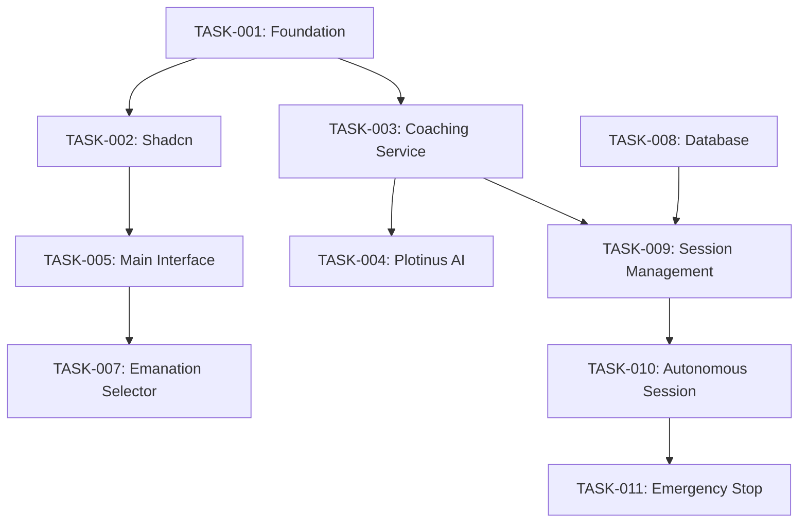

# 🔨 AI Coaching Feature - Atomic Tasks Breakdown

## **🎯 TASK OVERVIEW**
Atomic, testable tasks voor implementatie van AI Coaching feature. Elke task is onafhankelijk uitvoerbaar en heeft duidelijke acceptance criteria.

---

## **📦 PHASE 1: FOUNDATION SETUP**

### **TASK-001: Setup Feature Architecture**
**🎯 Objective**: Creëer de basis directory structure en core interfaces

**📋 Subtasks:**
- [ ] **TASK-001a**: Create feature directory structure
  ```bash
  src/features/01-ai-coaching/
  ├── components/
  ├── services/
  ├── hooks/
  ├── types/
  └── utils/
  ```

- [ ] **TASK-001b**: Define TypeScript interfaces
  ```typescript
  // types/coaching.types.ts
  interface CoachingSession {
    id: string;
    userId: string;
    mbtiType: string;
    emanationType: 'AI1' | 'AI2' | 'AI3';
    startTime: Date;
    estimatedDuration: number;
    currentPhase: CoachingPhase;
    insights: GeneratedInsight[];
    progressMetrics: ProgressMetrics;
  }
  ```

- [ ] **TASK-001c**: Setup barrel exports (index.ts files)

**✅ Acceptance Criteria:**
- [ ] Directory structure created en accessible
- [ ] All core types defined met proper TypeScript interfaces
- [ ] Import/export structure working
- [ ] No compilation errors

**⏱️ Estimated Time**: 2 hours  
**🔧 Dependencies**: None  
**👥 Assignee**: Agent-driven development

---

### **TASK-002: Shadcn Component Integration**
**🎯 Objective**: Integreer benodigde Shadcn components voor coaching interface

**📋 Subtasks:**
- [ ] **TASK-002a**: Install additional Shadcn components
  ```bash
  npx shadcn@latest add dialog card progress textarea button tabs badge avatar separator scroll-area
  ```

- [ ] **TASK-002b**: Create coaching-specific component wrappers
  ```typescript
  // components/ui/CoachingDialog.tsx
  import { Dialog } from '@/components/ui/dialog';
  
  interface CoachingDialogProps {
    session: CoachingSession;
    onSessionUpdate: (session: CoachingSession) => void;
  }
  ```

- [ ] **TASK-002c**: Implement responsive design tokens

**✅ Acceptance Criteria:**
- [ ] All required Shadcn components installed
- [ ] Coaching-specific wrappers created
- [ ] Components render correctly on mobile/desktop
- [ ] Design system consistency maintained

**⏱️ Estimated Time**: 3 hours  
**🔧 Dependencies**: TASK-001  
**👥 Assignee**: Agent + Shadcn MCP integration

---

## **📦 PHASE 2: CORE SERVICES**

### **TASK-003: Coaching Service Implementation**
**🎯 Objective**: Implementeer core coaching service met MBTI integration

**📋 Subtasks:**
- [ ] **TASK-003a**: Create CoachingService class
  ```typescript
  // services/coachingService.ts
  export class CoachingService {
    constructor(
      private agentExecutor: AgentExecutorService,
      private mbtiService: PersonalMBTICoachService,
      private plotinusAI: HogerZelfAIService
    ) {}
    
    async startCoachingSession(userId: string, preferences: CoachingPreferences): Promise<CoachingSession> {
      // Implementation
    }
    
    async generateInsights(session: CoachingSession, userInput: string): Promise<GeneratedInsight[]> {
      // Multi-emanation insight generation
    }
  }
  ```

- [ ] **TASK-003b**: Implement MBTI-optimized coaching strategies
  ```typescript
  // MBTI-specific coaching approaches
  private getCoachingStrategy(mbtiType: string): CoachingStrategy {
    // NT: analytical, systematic approach
    // NF: value-based, intuitive approach  
    // ST: practical, step-by-step approach
    // SF: people-oriented, emotional approach
  }
  ```

- [ ] **TASK-003c**: Integrate met Agent Executor voor autonome sessies

**✅ Acceptance Criteria:**
- [ ] CoachingService class fully implemented
- [ ] MBTI-specific strategies working
- [ ] Agent Executor integration functional
- [ ] Unit tests passing (>90% coverage)

**⏱️ Estimated Time**: 6 hours  
**🔧 Dependencies**: TASK-001, TASK-002, existing Agent Executor  
**👥 Assignee**: Senior agent developer

---

### **TASK-004: Plotinus AI Integration**
**🎯 Objective**: Integreer AI1/AI2/AI3 emanaties in coaching workflow

**📋 Subtasks:**
- [ ] **TASK-004a**: Extend HogerZelfAIService voor coaching
  ```typescript
  // services/plotinusCoachingService.ts
  export class PlotinusCoachingService extends HogerZelfAIService {
    async generateAI1CoachingContent(session: CoachingSession): Promise<AI1Content> {
      // Beauty/Esthetic coaching: visual exercises, creative expression
    }
    
    async generateAI2CoachingInsights(session: CoachingSession): Promise<AI2Insights> {
      // Wisdom/Cognitive coaching: deep analysis, pattern recognition
    }
    
    async generateAI3ActionPlans(session: CoachingSession): Promise<AI3ActionPlan> {
      // Goodness/Ethical coaching: practical actions, moral guidance
    }
  }
  ```

- [ ] **TASK-004b**: Implement emanation switching logic
- [ ] **TASK-004c**: Add emanation-specific UI adaptations

**✅ Acceptance Criteria:**
- [ ] All three emanations integrated in coaching
- [ ] Smooth switching between AI1/AI2/AI3
- [ ] UI adapts per emanation type
- [ ] Content quality meets standards

**⏱️ Estimated Time**: 5 hours  
**🔧 Dependencies**: TASK-003, existing HogerZelfAIService  
**👥 Assignee**: AI integration specialist

---

## **📦 PHASE 3: USER INTERFACE**

### **TASK-005: Main Coaching Interface**
**🎯 Objective**: Implementeer de primary coaching interface component

**📋 Subtasks:**
- [ ] **TASK-005a**: Create AICoachingInterface component
  ```typescript
  // components/AICoachingInterface.tsx
  interface AICoachingInterfaceProps {
    session: CoachingSession;
    onSessionUpdate: (session: CoachingSession) => void;
    onSessionComplete: () => void;
  }
  
  export const AICoachingInterface: React.FC<AICoachingInterfaceProps> = ({ 
    session, 
    onSessionUpdate, 
    onSessionComplete 
  }) => {
    // Main coaching interface with:
    // - MBTI-optimized layout
    // - Real-time AI responses
    // - Progress tracking
    // - Emanation selector
  }
  ```

- [ ] **TASK-005b**: Implement real-time chat interface
- [ ] **TASK-005c**: Add MBTI-specific layout adaptations
- [ ] **TASK-005d**: Integrate progress visualization

**✅ Acceptance Criteria:**
- [ ] Interface renders correctly alle MBTI types
- [ ] Real-time interaction working smoothly
- [ ] Visual progress tracking functional
- [ ] Mobile-responsive design verified

**⏱️ Estimated Time**: 8 hours  
**🔧 Dependencies**: TASK-002, TASK-003, TASK-004  
**👥 Assignee**: Frontend specialist + UX agent

---

### **TASK-006: Progress Tracking Components**
**🎯 Objective**: Implementeer visual progress tracking en analytics

**📋 Subtasks:**
- [ ] **TASK-006a**: Create SessionProgressTracker
  ```typescript
  // components/SessionProgressTracker.tsx
  interface SessionProgressTrackerProps {
    currentProgress: number;
    milestones: Milestone[];
    estimatedTimeRemaining: number;
    sessionPhase: CoachingPhase;
  }
  ```

- [ ] **TASK-006b**: Implement progress visualization charts
  ```typescript
  // Using Shadcn Charts
  import { LineChart, RadarChart, BarChart } from '@/components/ui/chart';
  
  // Progress over time
  // 9 levensgebieden radar
  // Session metrics bar chart
  ```

- [ ] **TASK-006c**: Add milestone celebration animations

**✅ Acceptance Criteria:**
- [ ] Progress accurately tracked en displayed
- [ ] Charts render with correct data
- [ ] Milestone achievements properly celebrated
- [ ] Performance optimized voor real-time updates

**⏱️ Estimated Time**: 4 hours  
**🔧 Dependencies**: TASK-005, Shadcn Charts  
**👥 Assignee**: Data visualization agent

---

### **TASK-007: Emanation Selector Interface**
**🎯 Objective**: Create intuitive emanation switching interface

**📋 Subtasks:**
- [ ] **TASK-007a**: Design EmanationSelector component
  ```typescript
  // components/EmanationSelector.tsx
  interface EmanationSelectorProps {
    currentEmanation: 'AI1' | 'AI2' | 'AI3';
    onEmanationChange: (emanation: 'AI1' | 'AI2' | 'AI3') => void;
    mbtiOptimized: boolean;
    availableEmanations: string[];
  }
  ```

- [ ] **TASK-007b**: Implement smooth transition animations
- [ ] **TASK-007c**: Add emanation-specific visual cues
- [ ] **TASK-007d**: Integrate met coaching workflow

**✅ Acceptance Criteria:**
- [ ] Intuitive emanation switching
- [ ] Smooth visual transitions
- [ ] Clear visual distinction tussen emanations
- [ ] MBTI-optimized presentation

**⏱️ Estimated Time**: 3 hours  
**🔧 Dependencies**: TASK-004, TASK-005  
**👥 Assignee**: UI/UX specialist

---

## **📦 PHASE 4: DATA PERSISTENCE**

### **TASK-008: V14 Database Integration**
**🎯 Objective**: Implementeer data persistence voor coaching sessions

**📋 Subtasks:**
- [ ] **TASK-008a**: Extend V14 schema voor coaching tables
  ```typescript
  // database/v14/schemas/coachingSchema.ts
  export const coachingSchema = {
    tables: [
      tableSchema({
        name: 'coaching_sessions',
        columns: [
          { name: 'user_id', type: 'string' },
          { name: 'mbti_type', type: 'string' },
          { name: 'emanation_focus', type: 'string' },
          { name: 'session_data', type: 'string' }, // JSON
          { name: 'progress_metrics', type: 'string' }, // JSON
          { name: 'created_at', type: 'number' },
          { name: 'updated_at', type: 'number' }
        ]
      }),
      // Additional tables...
    ]
  };
  ```

- [ ] **TASK-008b**: Create WatermelonDB models
- [ ] **TASK-008c**: Implement CRUD operations
- [ ] **TASK-008d**: Setup Supabase sync voor coaching data

**✅ Acceptance Criteria:**
- [ ] Database schema properly extended
- [ ] All CRUD operations working
- [ ] Offline-first functionality maintained
- [ ] Supabase sync working correctly

**⏱️ Estimated Time**: 5 hours  
**🔧 Dependencies**: V14 database system  
**👥 Assignee**: Database specialist

---

### **TASK-009: Session Management Service**
**🎯 Objective**: Implementeer session lifecycle management

**📋 Subtasks:**
- [ ] **TASK-009a**: Create SessionManagerService
  ```typescript
  // services/sessionManagerService.ts
  export class SessionManagerService {
    async createSession(userId: string, preferences: CoachingPreferences): Promise<CoachingSession> {}
    async saveSessionProgress(sessionId: string, progress: ProgressUpdate): Promise<void> {}
    async pauseSession(sessionId: string): Promise<void> {}
    async resumeSession(sessionId: string): Promise<CoachingSession> {}
    async completeSession(sessionId: string): Promise<SessionSummary> {}
  }
  ```

- [ ] **TASK-009b**: Implement auto-save functionality (elke 5 minuten)
- [ ] **TASK-009c**: Add session recovery logic
- [ ] **TASK-009d**: Implement session analytics tracking

**✅ Acceptance Criteria:**
- [ ] Session lifecycle fully managed
- [ ] Auto-save prevents data loss
- [ ] Session recovery works na disconnect
- [ ] Analytics properly tracked

**⏱️ Estimated Time**: 4 hours  
**🔧 Dependencies**: TASK-008  
**👥 Assignee**: Backend specialist

---

## **📦 PHASE 5: AUTONOMOUS OPERATION**

### **TASK-010: 4-6 Hour Autonomous Session**
**🎯 Objective**: Implementeer long-running autonomous coaching sessions

**📋 Subtasks:**
- [ ] **TASK-010a**: Configure Agent Executor voor lange sessies
  ```typescript
  // services/autonomousCoachingService.ts
  export class AutonomousCoachingService {
    private readonly MAX_SESSION_DURATION = 6 * 60 * 60 * 1000; // 6 hours
    private readonly CHECKPOINT_INTERVAL = 30 * 60 * 1000; // 30 minutes
    
    async startAutonomousSession(session: CoachingSession): Promise<void> {
      // Setup autonomous operation
    }
    
    private async handleCheckpoint(session: CoachingSession): Promise<void> {
      // Regular progress checks
    }
  }
  ```

- [ ] **TASK-010b**: Implement checkpoint system (elke 30 minuten)
- [ ] **TASK-010c**: Add session monitoring en health checks
- [ ] **TASK-010d**: Implement graceful session termination

**✅ Acceptance Criteria:**
- [ ] Sessions kunnen 6+ uur runnen
- [ ] Regular checkpoints prevent data loss
- [ ] Monitoring detecteert issues
- [ ] Graceful shutdown bij problemen

**⏱️ Estimated Time**: 6 hours  
**🔧 Dependencies**: TASK-003, TASK-009, Agent Executor  
**👥 Assignee**: System architecture specialist

---

### **TASK-011: Emergency Stop & Recovery**
**🎯 Objective**: Implementeer safety mechanisms voor autonome sessies

**📋 Subtasks:**
- [ ] **TASK-011a**: Create emergency stop conditions
  ```typescript
  interface EmergencyStopConditions {
    maxErrorCount: number;
    apiRateLimitHit: boolean;
    userInactivityTimeout: number;
    systemResourceExhaustion: boolean;
    unexpectedBehavior: boolean;
  }
  ```

- [ ] **TASK-011b**: Implement session recovery procedures
- [ ] **TASK-011c**: Add user notification system
- [ ] **TASK-011d**: Create session health dashboard

**✅ Acceptance Criteria:**
- [ ] Emergency stop working reliably
- [ ] Session recovery na interruption
- [ ] Users notified van session status
- [ ] Health metrics properly monitored

**⏱️ Estimated Time**: 4 hours  
**🔧 Dependencies**: TASK-010  
**👥 Assignee**: DevOps + reliability engineer

---

## **📦 PHASE 6: OPTIMIZATION & TESTING**

### **TASK-012: Performance Optimization**
**🎯 Objective**: Optimize voor production-ready performance

**📋 Subtasks:**
- [ ] **TASK-012a**: Implement React optimization patterns
  ```typescript
  // Use React.memo, useMemo, useCallback voor expensive operations
  // Implement virtual scrolling voor lange coaching histories
  // Optimize re-renders tijdens real-time updates
  ```

- [ ] **TASK-012b**: Optimize AI response caching
- [ ] **TASK-012c**: Implement lazy loading voor heavy components
- [ ] **TASK-012d**: Add performance monitoring

**✅ Acceptance Criteria:**
- [ ] Initial load <2 seconds
- [ ] AI responses <3 seconds
- [ ] UI updates <1 second
- [ ] Memory usage optimized voor lange sessies

**⏱️ Estimated Time**: 4 hours  
**🔧 Dependencies**: All previous tasks  
**👥 Assignee**: Performance specialist

---

### **TASK-013: Comprehensive Testing**
**🎯 Objective**: Implement volledige test coverage

**📋 Subtasks:**
- [ ] **TASK-013a**: Unit tests voor alle services
  ```typescript
  // __tests__/coachingService.test.ts
  describe('CoachingService', () => {
    test('should generate MBTI-optimized insights', async () => {
      // Test implementation
    });
    
    test('should handle 6-hour autonomous sessions', async () => {
      // Long-running session test
    });
  });
  ```

- [ ] **TASK-013b**: Integration tests voor complete workflows
- [ ] **TASK-013c**: E2E tests voor user journeys
- [ ] **TASK-013d**: Performance tests voor load testing

**✅ Acceptance Criteria:**
- [ ] >90% unit test coverage
- [ ] All integration tests passing
- [ ] E2E user journeys verified
- [ ] Performance benchmarks met

**⏱️ Estimated Time**: 6 hours  
**🔧 Dependencies**: All implementation tasks  
**👥 Assignee**: QA automation specialist

---

### **TASK-014: User Acceptance Testing**
**🎯 Objective**: Validate met echte users per MBTI type

**📋 Subtasks:**
- [ ] **TASK-014a**: Setup UAT environments
- [ ] **TASK-014b**: Recruit testers per MBTI type (16 types minimum)
- [ ] **TASK-014c**: Conduct coaching sessions met feedback collection
- [ ] **TASK-014d**: Analyze feedback en implement improvements

**✅ Acceptance Criteria:**
- [ ] All 16 MBTI types tested
- [ ] >4.5/5 average satisfaction score
- [ ] >80% task completion rate
- [ ] Critical feedback addressed

**⏱️ Estimated Time**: 8 hours (over multiple days)  
**🔧 Dependencies**: TASK-013  
**👥 Assignee**: User research specialist

---

## **📋 TASK SUMMARY & PRIORITIZATION**

### **🚨 Critical Path Tasks**
1. **TASK-001**: Foundation Setup (Required for everything)
2. **TASK-003**: Coaching Service (Core functionality)
3. **TASK-005**: Main Interface (User interaction)
4. **TASK-008**: Database Integration (Data persistence)
5. **TASK-010**: Autonomous Operation (Key differentiator)

### **⚡ Quick Wins**
- **TASK-002**: Shadcn Integration (2-3 hours, high visibility)
- **TASK-007**: Emanation Selector (3 hours, great UX impact)
- **TASK-006**: Progress Tracking (4 hours, immediate value)

### **🔧 Technical Dependencies**


### **📊 Resource Allocation**
- **Total Estimated Time**: 62 hours
- **Parallel Development**: Possible na TASK-001 completion
- **Agent Assignments**: Mix van specialized agents per domain
- **Quality Gates**: Testing at each phase end

**🎯 Ready voor implementation.md planning!**