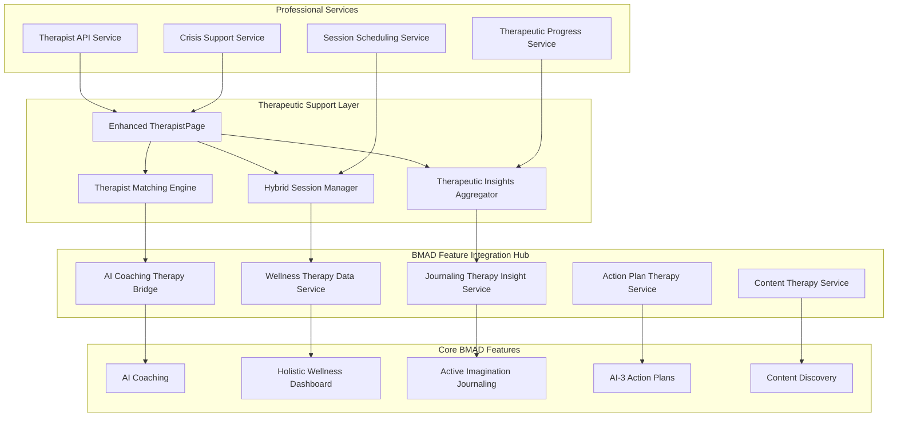

# 🏗️ Therapeut & Coach Feature - BMAD Architecture v1.0

## **🎯 ARCHITECTURAL VISION**
Een hybride AI-human therapeutische architectuur die professionele therapy seamless integreert met alle BMAD features door middel van advanced MBTI-informed matching, cross-feature data orchestration, en real-time AI session enhancement.

---

## **🏛️ SYSTEM ARCHITECTURE OVERVIEW**

### **High-Level BMAD Therapy Architecture**


### **BMAD Therapy Integration Architecture**
```typescript
interface BMADTherapyArchitecture {
  // Core Therapy Infrastructure
  therapeuticInfrastructure: {
    enhancedTherapistPage: EnhancedTherapistPageComponent;
    aiHumanHybridEngine: AIHumanHybridEngine;
    professionalNetworkIntegration: ProfessionalNetworkIntegration;
    therapeuticDataOrchestrator: TherapeuticDataOrchestrator;
  };
  
  // BMAD Feature Integration Layer
  bMADIntegrationLayer: {
    crossFeatureDataAggregator: CrossFeatureDataAggregator;
    therapeuticInsightSynthesizer: TherapeuticInsightSynthesizer;
    progressSynchronizationEngine: ProgressSynchronizationEngine;
    privacyPreservingDataBridge: PrivacyPreservingDataBridge;
  };
  
  // AI Enhancement Services
  aiEnhancementServices: {
    therapistMatchingAI: TherapistMatchingAIService;
    sessionPreparationAI: SessionPreparationAIService;
    realTimeSessionAI: RealTimeSessionAIService;
    postSessionIntegrationAI: PostSessionIntegrationAIService;
  };
  
  // Professional Integration Services
  professionalIntegrationServices: {
    therapistNetworkAPI: TherapistNetworkAPIService;
    sessionManagementService: SessionManagementService;
    professionalProgressReporting: ProfessionalProgressReportingService;
    emergencyCrisisSupport: EmergencyCrisisSupport;
  };
}
```

---

## **🔄 CROSS-FEATURE DATA ORCHESTRATION**

### **Therapeutic Data Flow Architecture**
```typescript
interface TherapeuticDataFlowArchitecture {
  // Inbound Data Aggregation
  inboundDataAggregation: {
    aiCoachingDataPipeline: {
      source: 'AI Coaching Feature';
      dataTypes: ['plotinus_insights', 'coaching_progress', 'mbti_development', 'cognitive_function_growth'];
      aggregationMethod: 'real_time_streaming';
      privacyLevel: 'therapist_consent_required';
      transformations: ['insight_summarization', 'progress_visualization', 'pattern_identification'];
    };
    
    wellnessDataPipeline: {
      source: 'Holistic Wellness Dashboard';
      dataTypes: ['levensgebied_scores', 'stress_patterns', 'wellness_trends', 'holistic_progress'];
      aggregationMethod: 'daily_batch_with_realtime_alerts';
      privacyLevel: 'selective_sharing_with_consent';
      transformations: ['trend_analysis', 'pattern_recognition', 'therapeutic_contextualization'];
    };
    
    journalingDataPipeline: {
      source: 'Active Imagination Journaling';
      dataTypes: ['emotional_patterns', 'vector_embeddings', 'journaling_insights', 'mood_trends'];
      aggregationMethod: 'privacy_preserving_analysis';
      privacyLevel: 'encrypted_with_user_consent';
      transformations: ['emotion_pattern_analysis', 'therapeutic_topic_extraction', 'insight_preparation'];
    };
    
    actionPlanDataPipeline: {
      source: 'AI-3 Action Plans';
      dataTypes: ['action_completion_rates', 'goal_progress', 'behavioral_patterns', 'milestone_achievements'];
      aggregationMethod: 'progress_focused_aggregation';
      privacyLevel: 'therapist_shared_with_consent';
      transformations: ['progress_tracking', 'goal_alignment', 'therapeutic_action_planning'];
    };
    
    contentDataPipeline: {
      source: 'Content Discovery';
      dataTypes: ['content_engagement', 'learning_preferences', 'topic_interests', 'educational_progress'];
      aggregationMethod: 'learning_pattern_analysis';
      privacyLevel: 'anonymized_with_therapist_insights';
      transformations: ['engagement_analysis', 'therapeutic_content_curation', 'learning_support_optimization'];
    };
  };
  
  // Outbound Therapeutic Enhancement
  outboundTherapeuticEnhancement: {
    aiCoachingEnhancement: {
      therapyInformedCoaching: 'Integrate therapy goals into AI coaching objectives';
      therapeuticBreakthroughIntegration: 'Apply therapy insights to coaching conversations';
      hybridProgressAlignment: 'Align coaching and therapy progress tracking';
      professionalGuidanceIntegration: 'Integrate professional guidance into AI coaching approach';
    };
    
    wellnessEnhancement: {
      therapyInformedWellnessGoals: 'Create wellness goals based on therapy session insights';
      therapeuticWellnessTracking: 'Track wellness improvements in context of therapy progress';
      holisticTherapeuticPlanning: 'Plan wellness activities that support therapy objectives';
      stressManagementTherapyIntegration: 'Integrate stress management strategies from therapy';
    };
    
    journalingEnhancement: {
      therapistGuidedJournalingPrompts: 'Provide journaling prompts based on therapy session work';
      therapeuticEmotionalProcessing: 'Support emotional processing of therapy sessions through journaling';
      insightPreparationJournaling: 'Use journaling to prepare insights for upcoming therapy sessions';
      progressReflectionJournaling: 'Journaling focused on reflecting on therapeutic progress';
    };
    
    actionPlanEnhancement: {
      therapyGoalActionPlans: 'Convert therapy session goals into actionable AI-3 plans';
      therapeuticSkillDevelopmentPlans: 'Create action plans for developing therapeutic skills';
      behaviorChangeActionPlans: 'Action plans specifically for therapeutic behavior change';
      progressAccountabilityPlans: 'Action plans with built-in therapy progress accountability';
    };
    
    contentEnhancement: {
      therapistRecommendedContent: 'Surface content specifically recommended by therapist';
      therapeuticTopicContent: 'Curate content based on current therapy discussion topics';
      skillDevelopmentContent: 'Educational content to support therapeutic skill development';
      betweenSessionLearningSupport: 'Content to support continued learning between therapy sessions';
    };
  };
}
```

### **Privacy-Preserving Data Bridge**
```typescript
interface PrivacyPreservingDataBridge {
  // Granular Consent Management
  granularConsentManagement: {
    featureSpecificConsent: {
      aiCoachingDataSharing: ConsentLevel;
      wellnessDataSharing: ConsentLevel;
      journalingDataSharing: ConsentLevel;
      actionPlanDataSharing: ConsentLevel;
      contentDataSharing: ConsentLevel;
    };
    
    therapistSpecificConsent: {
      individualTherapistConsent: Map<TherapistID, FeatureConsentMap>;
      sessionSpecificConsent: Map<SessionID, DataSharingConsent>;
      emergencyDataSharingConsent: EmergencyDataSharingConsent;
      temporaryConsentManagement: TemporaryConsentManager;
    };
  };
  
  // Data Transformation & Anonymization
  dataTransformationSecurity: {
    clientSideEncryption: {
      sensitiveDataEncryption: 'Encrypt sensitive data before sharing with therapist systems';
      keyManagementService: 'Secure key management for data encryption/decryption';
      zeroKnowledgeProofs: 'Use zero-knowledge proofs for sensitive insight sharing';
      homomorphicEncryption: 'Enable computation on encrypted therapeutic data';
    };
    
    dataMinimization: {
      insightExtractionOnly: 'Share insights rather than raw data when possible';
      aggregatedDataSharing: 'Share aggregated patterns rather than individual data points';
      temporalDataLimiting: 'Limit data sharing to specific time periods';
      contextualDataFiltering: 'Filter data to only therapeutically relevant information';
    };
  };
  
  // Compliance & Audit
  complianceAuditFramework: {
    hipaaCompliance: HIPAAComplianceFramework;
    gdprCompliance: GDPRComplianceFramework;
    dataAccessAuditing: DataAccessAuditingService;
    consentAuditTrail: ConsentAuditTrailService;
  };
}
```

---

## **🤖 AI-ENHANCED THERAPEUTIC SERVICES**

### **Therapist Matching AI Architecture**
```typescript
interface TherapistMatchingAIArchitecture {
  // Multi-Dimensional Compatibility Scoring
  compatibilityScoring: {
    mbtiCompatibilityEngine: {
      cognitiveFunction Alignment: 'Score compatibility based on cognitive function preferences';
      communicationStyleMatching: 'Match communication styles with MBTI types';
      therapyApproachCompatibility: 'Align therapy approaches with MBTI preferences';
      personalityDevelopmentFocus: 'Match therapists who specialize in specific MBTI development areas';
    };
    
    bMADSpecializationMatching: {
      plotinusEmanationExpertise: 'Match therapists with expertise in specific emanation levels';
      levensgebiedSpecializationMatching: 'Match therapists with expertise in specific life domains';
      journalingTherapyExpertise: 'Match therapists experienced in journaling-based therapy';
      actionPlanTherapeuticSupport: 'Match therapists who support action-based therapeutic approaches';
    };
    
    holisticNeedsAssessment: {
      currentBMADUsagePatterns: 'Analyze current BMAD feature usage to inform therapist matching';
      developmentalNeedsAssessment: 'Assess developmental needs across all BMAD features';
      therapeuticGoalAlignment: 'Align potential therapists with specific therapeutic goals';
      progressBasedRecommendations: 'Recommend therapists based on current progress and challenges';
    };
  };
  
  // Dynamic Matching Refinement
  dynamicMatchingRefinement: {
    feedbackLearningSystem: 'Learn from user feedback to improve matching accuracy';
    progressBasedRefinement: 'Refine matches based on therapeutic progress with current therapist';
    crossFeaturePerformanceAnalysis: 'Analyze how therapist matching impacts progress across BMAD features';
    adaptiveMatchingAlgorithms: 'Continuously improve matching algorithms based on outcomes';
  };
}
```

### **Session Enhancement AI Architecture**
```typescript
interface SessionEnhancementAIArchitecture {
  // Pre-Session AI Preparation
  preSessionAIPreparation: {
    crossFeatureInsightAggregation: {
      aiCoachingInsightSummary: 'Summarize recent AI coaching insights for therapy prep';
      wellnessPatternAnalysis: 'Analyze wellness patterns relevant to therapy session';
      journalingEmotionalPreparation: 'Prepare emotional insights from recent journaling activity';
      actionPlanProgressReview: 'Review action plan progress for therapy discussion';
    };
    
    sessionObjectiveRecommendation: {
      aiGeneratedSessionObjectives: 'AI-generated session objectives based on recent activity';
      therapeuticPriorityIdentification: 'Identify therapeutic priorities based on BMAD data';
      personalizedSessionPreparation: 'Personalized preparation recommendations for therapy session';
      progressGapAnalysis: 'Identify gaps in progress that could benefit from therapeutic focus';
    };
  };
  
  // Real-Time Session AI Support
  realTimeSessionAISupport: {
    therapistFacingAIInsights: {
      realTimePatternRecognition: 'Real-time recognition of patterns in client behavior and responses';
      contextualInsightSuggestions: 'Context-aware suggestions for therapeutic interventions';
      progressIndicatorHighlighting: 'Highlight progress indicators during session';
      crossFeatureRelevanceAlerts: 'Alert therapist to relevant information from other BMAD features';
    };
    
    clientFacingAISupport: {
      emotionalStateTracking: 'Track emotional state during session for personalized support';
      insightClarificationSupport: 'AI support for clarifying and expressing insights during session';
      sessionParticipationEnhancement: 'AI support to enhance client participation in session';
      realTimeReflectionPrompts: 'AI-generated reflection prompts during appropriate session moments';
    };
  };
  
  // Post-Session AI Integration
  postSessionAIIntegration: {
    sessionOutcomeAnalysis: {
      therapeuticBreakthroughIdentification: 'Identify therapeutic breakthroughs for cross-feature integration';
      goalProgressAnalysis: 'Analyze progress toward therapeutic goals';
      actionItemExtraction: 'Extract action items from session for integration with action plans';
      insightSynthesisForOtherFeatures: 'Synthesize session insights for integration with other BMAD features';
    };
    
    crossFeatureUpdateOrchestration: {
      aiCoachingGoalUpdates: 'Update AI coaching goals based on therapy session outcomes';
      wellnessGoalRefinement: 'Refine wellness goals based on therapeutic insights';
      journalingPromptGeneration: 'Generate journaling prompts based on session work';
      actionPlanTherapeuticAlignment: 'Align action plans with therapeutic progress and goals';
    };
  };
}
```

---

## **📊 PROFESSIONAL INTEGRATION ARCHITECTURE**

### **Therapist Network Integration**
```typescript
interface TherapistNetworkIntegration {
  // Professional Therapist API Layer
  professionalTherapistAPILayer: {
    therapistDirectoryIntegration: {
      professionalCredentialVerification: 'Verify therapist credentials and licensing';
      specialtyAndApproachVerification: 'Verify therapist specialties and therapeutic approaches';
      bMADIntegrationCapabilityAssessment: 'Assess therapist capability for BMAD feature integration';
      continuousEducationTracking: 'Track therapist continuing education relevant to BMAD approaches';
    };
    
    sessionManagementIntegration: {
      secureVideoSessionIntegration: 'Integrate secure video session capabilities';
      sessionSchedulingCoordination: 'Coordinate session scheduling between client and therapist';
      sessionNoteSecureSharing: 'Secure sharing of session notes (with consent)';
      progressReportingIntegration: 'Integration for progress reporting between sessions';
    };
  };
  
  // Professional Workflow Integration
  professionalWorkflowIntegration: {
    therapeuticProgressReporting: {
      standardizedProgressMetrics: 'Standardized progress metrics compatible with professional reporting';
      crossFeatureProgressSynthesis: 'Synthesize progress across BMAD features for professional reporting';
      outcomeTrackingIntegration: 'Integration with professional outcome tracking systems';
      insuranceProgressReporting: 'Progress reporting compatible with insurance requirements';
    };
    
    professionalCollaboration: {
      multitherapistCollaboration: 'Support collaboration between multiple therapeutic professionals';
      referralNetworkIntegration: 'Integration with professional referral networks';
      consultationSupport: 'Support for therapeutic consultation and supervision';
      continuityOfCareCoordination: 'Coordinate continuity of care across different therapeutic professionals';
    };
  };
}
```

### **Crisis Support Integration Architecture**
```typescript
interface CrisisSupportIntegrationArchitecture {
  // AI-Powered Crisis Detection
  aiPoweredCrisisDetection: {
    multiModalCrisisIndicators: {
      journalingEmotionalCrisisPatterns: 'Detect crisis patterns in journaling emotional analysis';
      wellnessRapidDeteriorationDetection: 'Detect rapid deterioration in wellness metrics';
      actionPlanEngagementCrisisIndicators: 'Detect crisis through sudden disengagement from action plans';
      aiCoachingCrisisConversationDetection: 'Detect crisis indicators in AI coaching conversations';
    };
    
    riskAssessmentAI: {
      adaptiveRiskScoring: 'Adaptive risk scoring based on MBTI type and personal patterns';
      escalationTriggerIdentification: 'Identify triggers that require escalation to professional support';
      contextualRiskAssessment: 'Assess risk in context of individual user patterns and preferences';
      continuousRiskMonitoring: 'Continuous monitoring for risk escalation or de-escalation';
    };
  };
  
  // Emergency Response Orchestration
  emergencyResponseOrchestration: {
    immediateResponseProtocol: {
      emergencyTherapistContact: 'Immediate contact with emergency-available therapist';
      crisisHotlineIntegration: 'Integration with professional crisis hotlines';
      emergencyContactNotification: 'Notification of emergency contacts (with consent)';
      emergencyServiceCoordination: 'Coordination with emergency services when necessary';
    };
    
    supportNetworkActivation: {
      personalSupportNetworkActivation: 'Activate personal support network based on crisis level';
      professionalSupportEscalation: 'Escalate to professional support based on crisis assessment';
      communitySupportResourceActivation: 'Activate community support resources';
      continuousCrisisSupportCoordination: 'Coordinate continuous support during crisis period';
    };
  };
  
  // Post-Crisis Integration
  postCrisisIntegration: {
    recoveryPlanIntegration: {
      crisisRecoveryActionPlans: 'Create specialized action plans for crisis recovery';
      therapeuticRecoverySupport: 'Coordinate therapeutic support for crisis recovery';
      wellnessRecoveryTracking: 'Track wellness recovery with enhanced monitoring';
      preventiveCareEnhancement: 'Enhance preventive care based on crisis learning';
    };
    
    crisisLearningIntegration: {
      crisisPatternAnalysis: 'Analyze crisis patterns for future prevention';
      personalizedCrisisPreventionPlanning: 'Create personalized crisis prevention plans';
      supportSystemStrengthening: 'Strengthen support systems based on crisis learning';
      therapeuticApproachRefinement: 'Refine therapeutic approach based on crisis experience';
    };
  };
}
```

---

## **⚡ PERFORMANCE & SCALABILITY ARCHITECTURE**

### **Real-Time Data Processing Architecture**
```typescript
interface RealTimeDataProcessingArchitecture {
  // Streaming Data Pipeline
  streamingDataPipeline: {
    eventDrivenArchitecture: {
      bMADFeatureEventStreaming: 'Real-time event streaming from all BMAD features';
      therapeuticInsightEventProcessing: 'Real-time processing of therapeutic insight events';
      crossFeatureEventCorrelation: 'Real-time correlation of events across features';
      therapeuticActionEventTriggering: 'Real-time triggering of therapeutic actions based on events';
    };
    
    dataStreamOptimization: {
      intelligentDataFiltering: 'Filter data streams for therapeutically relevant information';
      adaptiveStreamingCompression: 'Compress data streams for optimal real-time performance';
      prioritizedDataStreaming: 'Prioritize critical therapeutic data in streaming pipelines';
      redundancyEliminationOptimization: 'Eliminate redundant data in real-time streams';
    };
  };
  
  // Scalable AI Processing
  scalableAIProcessing: {
    distributedAIInference: {
      therapeuticInsightDistributedProcessing: 'Distribute therapeutic insight processing across multiple AI services';
      loadBalancedAIRequestHandling: 'Load balance AI requests for optimal performance';
      adaptiveAIResourceAllocation: 'Adaptively allocate AI resources based on therapeutic workload';
      cacheOptimizedAIInferencing: 'Cache AI inference results for improved performance';
    };
    
    edgeComputingIntegration: {
      clientSideTherapeuticAIProcessing: 'Process therapeutic AI on client side for privacy and performance';
      hybridCloudEdgeProcessing: 'Hybrid cloud-edge processing for optimal performance and privacy';
      offlineCapableTherapeuticAI: 'Offline-capable therapeutic AI for continuous support';
      adaptiveComputingResourceUtilization: 'Adaptively utilize computing resources based on needs';
    };
  };
}
```

### **Scalability & Availability Architecture**
```typescript
interface ScalabilityAvailabilityArchitecture {
  // High Availability Therapeutic Services
  highAvailabilityTherapeuticServices: {
    redundantTherapeuticInfrastructure: {
      multiRegionTherapeuticServices: 'Multi-region deployment for high availability therapeutic services';
      failoverTherapeuticSupport: 'Automatic failover for continuous therapeutic support';
      disasterRecoveryTherapeuticData: 'Disaster recovery for therapeutic data and services';
      continuousTherapeuticServiceMonitoring: 'Continuous monitoring of therapeutic service availability';
    };
    
    scalableTherapistNetworkIntegration: {
      dynamicTherapistNetworkScaling: 'Dynamically scale therapist network integration based on demand';
      geographicallyDistributedTherapistSupport: 'Support geographically distributed therapist networks';
      adaptiveTherapistMatchingScaling: 'Scale therapist matching services based on user load';
      elasticSessionManagementScaling: 'Elastic scaling of session management infrastructure';
    };
  };
  
  // Performance Optimization
  performanceOptimization: {
    cachingStrategies: {
      therapeuticInsightCaching: 'Cache therapeutic insights for improved performance';
      therapistMatchingResultCaching: 'Cache therapist matching results for faster recommendations';
      crossFeatureDataCaching: 'Cache cross-feature data for improved integration performance';
      sessionPreparationDataCaching: 'Cache session preparation data for faster session setup';
    };
    
    databaseOptimization: {
      therapeuticDataIndexing: 'Optimize database indexing for therapeutic data queries';
      crossFeatureDataQueryOptimization: 'Optimize cross-feature data queries for performance';
      therapeuticProgressTrackingOptimization: 'Optimize therapeutic progress tracking database operations';
      scalableTherapeuticDataArchiving: 'Scalable archiving of therapeutic data for long-term storage';
    };
  };
}
```

---

## **🔒 SECURITY & PRIVACY ARCHITECTURE**

### **Comprehensive Privacy Protection**
```typescript
interface ComprehensivePrivacyProtection {
  // End-to-End Encryption
  endToEndEncryption: {
    therapeuticDataEncryption: {
      clientSideEncryptionBeforeStorage: 'Encrypt all therapeutic data on client side before storage';
      endToEndSessionEncryption: 'End-to-end encryption for all therapy sessions';
      keyRotationManagement: 'Automatic key rotation for therapeutic data encryption';
      zeroKnowledgeTherapeuticArchitecture: 'Zero-knowledge architecture for sensitive therapeutic data';
    };
    
    crossFeatureDataProtection: {
      compartmentalizedDataEncryption: 'Encrypt data from each BMAD feature separately';
      selectiveDecryptionForTherapeuticUse: 'Selectively decrypt only necessary data for therapeutic use';
      temporaryDecryptionForSessionUse: 'Temporary decryption for active therapy sessions only';
      automaticReEncryptionPostSession: 'Automatic re-encryption after therapy session completion';
    };
  };
  
  // Professional Compliance
  professionalCompliance: {
    hipaaCompliantInfrastructure: {
      hipaaCompliantDataStorage: 'HIPAA-compliant storage for all therapeutic data';
      hipaaCompliantDataTransmission: 'HIPAA-compliant transmission of therapeutic data';
      hipaaCompliantAccessControls: 'HIPAA-compliant access controls for therapeutic data';
      hipaaCompliantAuditLogging: 'HIPAA-compliant audit logging for all therapeutic data access';
    };
    
    internationalPrivacyCompliance: {
      gdprCompliantDataProcessing: 'GDPR-compliant processing of therapeutic data';
      rightToDataPortability: 'Support for data portability rights in therapeutic data';
      rightToBeForgettenImplementation: 'Implementation of right to be forgotten for therapeutic data';
      crossBorderDataTransferCompliance: 'Compliant cross-border transfer of therapeutic data';
    };
  };
}
```

---

## **📱 COMPONENT INTEGRATION ARCHITECTURE**

### **Enhanced TherapistPage Component Architecture**
```typescript
interface EnhancedTherapistPageComponentArchitecture {
  // Core Enhanced Components Structure
  componentStructure: {
    mainTherapistPageContainer: {
      component: 'EnhancedTherapistPage';
      props: {
        userBMADProfile: BMADUserProfile;
        availableTherapists: BMADTherapist[];
        currentSessions: BMADTherapeuticSession[];
        crossFeatureInsights: CrossFeatureInsight[];
      };
      children: [
        'BMADTherapistMatchingInterface',
        'HybridSessionDashboard', 
        'TherapeuticInsightsAggregator',
        'CrossFeatureTherapyDashboard'
      ];
    };
    
    therapistMatchingInterface: {
      component: 'BMADTherapistMatchingInterface';
      features: [
        'mbtiCompatibilityScoring',
        'bMADSpecializationMatching',
        'holisticNeedsAssessment',
        'progressBasedRecommendations'
      ];
      integrations: [
        'aiCoachingDataIntegration',
        'wellnessDataIntegration',
        'journalingPatternIntegration',
        'actionPlanProgressIntegration'
      ];
    };
    
    hybridSessionDashboard: {
      component: 'HybridSessionDashboard';
      features: [
        'aiHumanSessionTransitions',
        'crossFeatureSessionPreparation',
        'realTimeSessionEnhancement',
        'postSessionIntegration'
      ];
      supportedSessionTypes: [
        'pureAICoachingSessions',
        'pureHumanTherapySessions',
        'hybridAIAssistedSessions',
        'emergencyCrisisSessions'
      ];
    };
  };
  
  // Specialized Integration Components
  specializedIntegrationComponents: {
    therapeuticInsightsAggregator: {
      component: 'TherapeuticInsightsAggregator';
      dataSourceIntegrations: [
        'aiCoachingInsightExtraction',
        'wellnessPatternAnalysis',
        'journalingEmotionalInsights',
        'actionPlanProgressInsights',
        'contentEngagementInsights'
      ];
      outputFormats: [
        'therapistFacingInsightSummary',
        'clientFacingProgressVisualization',
        'sessionPreparationBriefing',
        'crossFeatureProgressReport'
      ];
    };
    
    crossFeatureTherapyDashboard: {
      component: 'CrossFeatureTherapyDashboard';
      therapeuticViews: [
        'holisticClientProgressView',
        'therapeuticGoalTrackingView',
        'crossFeatureInsightSynthesisView',
        'therapeuticActionPlanningView'
      ];
      professionalFeatures: [
        'progressReportGeneration',
        'therapeuticGoalSetting',
        'crossFeatureRecommendations',
        'collaborativeTreatmentPlanning'
      ];
    };
  };
}
```

### **Component Data Flow Architecture**
```typescript
interface ComponentDataFlowArchitecture {
  // Inbound Data Flow to Therapeutic Components
  inboundDataFlow: {
    bMADFeatureToTherapeuticComponentFlow: {
      aiCoachingToTherapeuticFlow: {
        sourceComponent: 'AI Coaching Feature';
        targetComponent: 'TherapeuticInsightsAggregator';
        dataTransformationPipeline: [
          'plotinusInsightExtraction',
          'coachingProgressSummarization',
          'mbtiDevelopmentInsightGeneration',
          'therapeuticRelevanceFiltering'
        ];
        realTimeUpdating: true;
        privacyFiltering: 'therapistConsentBased';
      };
      
      wellnessToTherapeuticFlow: {
        sourceComponent: 'Holistic Wellness Dashboard';
        targetComponent: 'BMADTherapistMatchingInterface';
        dataTransformationPipeline: [
          'levensgebiedScoreAggregation',
          'stressPatternAnalysis',
          'wellnessTrendIdentification',
          'therapeuticPriorityMapping'
        ];
        realTimeUpdating: true;
        privacyFiltering: 'selectiveDataSharing';
      };
    };
  };
  
  // Outbound Data Flow from Therapeutic Components
  outboundDataFlow: {
    therapeuticToBMADFeatureFlow: {
      therapeuticToAICoachingFlow: {
        sourceComponent: 'HybridSessionDashboard';
        targetComponent: 'AI Coaching Feature';
        dataTransformationPipeline: [
          'therapyGoalExtraction',
          'therapeuticInsightSynthesis',
          'coachingObjectiveAlignment',
          'progressSynchronization'
        ];
        triggers: ['sessionCompletion', 'therapeuticBreakthrough', 'goalAdjustment'];
        privacyProtection: 'userConsentRequired';
      };
      
      therapeuticToActionPlanFlow: {
        sourceComponent: 'CrossFeatureTherapyDashboard';
        targetComponent: 'AI-3 Action Plans';
        dataTransformationPipeline: [
          'therapySessionActionExtraction',
          'therapeuticGoalActionPlanConversion',
          'skillDevelopmentActionGeneration',
          'behaviorChangeActionPlanning'
        ];
        triggers: ['actionItemIdentification', 'therapeuticHomeworkAssignment', 'skillDevelopmentNeed'];
        privacyProtection: 'therapeuticDataEncryption';
      };
    };
  };
}
```

---

## **🔧 TECHNICAL IMPLEMENTATION ARCHITECTURE**

### **Technology Stack Integration**
```typescript
interface TechnologyStackIntegration {
  // Frontend Enhancement Stack
  frontendEnhancementStack: {
    reactEnhancements: {
      bMADTherapeuticComponents: 'React components specifically designed for BMAD therapeutic integration';
      nextUITherapeuticTheming: 'NextUI theming optimized for therapeutic interface requirements';
      glassmorphismTherapeuticDesign: 'Glassmorphism design patterns for calming therapeutic interfaces';
      responsiveTherapeuticLayouts: 'Responsive layouts optimized for therapeutic session experiences';
    };
    
    stateManagementEnhancements: {
      zustandTherapeuticState: 'Zustand store patterns for therapeutic state management';
      watermelonDBTherapeuticSync: 'WatermelonDB integration for offline therapeutic data management';
      supabaseTherapeuticRealTime: 'Supabase real-time subscriptions for therapeutic data updates';
      crossFeatureStateOrchestration: 'State orchestration across BMAD features for therapeutic integration';
    };
  };
  
  // Backend Integration Stack
  backendIntegrationStack: {
    aiServiceIntegration: {
      openAITherapeuticEnhancement: 'OpenAI integration for therapeutic AI enhancement';
      localAITherapeuticProcessing: 'Local AI processing for privacy-sensitive therapeutic data';
      therapeuticAIOrchestration: 'AI orchestration for complex therapeutic workflows';
      multiModalAITherapeuticAnalysis: 'Multi-modal AI analysis for comprehensive therapeutic insights';
    };
    
    professionalServiceIntegration: {
      therapistNetworkAPIIntegration: 'Integration with professional therapist network APIs';
      sessionManagementAPIIntegration: 'Integration with session management and scheduling APIs';
      healthcareDataExchangeIntegration: 'Integration with healthcare data exchange standards';
      emergencyServiceIntegration: 'Integration with emergency and crisis support services';
    };
  };
}
```

### **Deployment & Infrastructure Architecture**
```typescript
interface DeploymentInfrastructureArchitecture {
  // Containerized Therapeutic Services
  containerizedTherapeuticServices: {
    therapeuticServiceContainerization: {
      enhancedTherapistPageContainer: 'Containerized deployment of enhanced TherapistPage components';
      therapeuticAIServiceContainer: 'Containerized therapeutic AI services';
      crossFeatureIntegrationContainer: 'Containerized cross-feature integration services';
      emergencySupportServiceContainer: 'Containerized emergency support services';
    };
    
    kubernetesTherapeuticOrchestration: {
      therapeuticServiceOrchestration: 'Kubernetes orchestration for therapeutic services';
      autoScalingTherapeuticWorkloads: 'Auto-scaling for variable therapeutic workloads';
      highAvailabilityTherapeuticDeployment: 'High availability deployment for critical therapeutic services';
      therapeuticServiceMeshIntegration: 'Service mesh integration for secure therapeutic service communication';
    };
  };
  
  // Cloud Infrastructure Optimization
  cloudInfrastructureOptimization: {
    multiCloudTherapeuticDeployment: {
      primaryCloudTherapeuticServices: 'Primary cloud deployment for main therapeutic services';
      backupCloudTherapeuticFailover: 'Backup cloud deployment for therapeutic service failover';
      hybridCloudTherapeuticOptimization: 'Hybrid cloud optimization for therapeutic workload distribution';
      edgeTherapeuticProcessing: 'Edge deployment for low-latency therapeutic processing';
    };
    
    complianceOptimizedInfrastructure: {
      hipaaCompliantCloudInfrastructure: 'HIPAA-compliant cloud infrastructure for therapeutic data';
      gdprCompliantDataResidency: 'GDPR-compliant data residency for European therapeutic users';
      securityOptimizedNetworking: 'Security-optimized networking for therapeutic data transmission';
      auditOptimizedLogging: 'Audit-optimized logging for therapeutic service compliance';
    };
  };
}
```

---

## **🎯 INTEGRATION SUCCESS METRICS**

### **Therapeutic Integration KPIs**
```typescript
interface TherapeuticIntegrationKPIs {
  // Cross-Feature Integration Effectiveness
  crossFeatureIntegrationEffectiveness: {
    dataIntegrationAccuracy: {
      metric: 'Accuracy of cross-feature data integration for therapeutic use';
      target: '>95% accuracy in therapeutic data aggregation';
      measurement: 'Weekly accuracy assessment of cross-feature data synthesis';
    };
    
    therapeuticInsightRelevance: {
      metric: 'Relevance of AI-generated therapeutic insights';
      target: '>90% therapist-rated relevance for AI-generated insights';
      measurement: 'Monthly therapist feedback on AI insight quality';
    };
    
    progressSynchronizationEffectiveness: {
      metric: 'Effectiveness of progress synchronization across features';
      target: '>95% consistency in progress tracking across all BMAD features';
      measurement: 'Continuous monitoring of progress synchronization accuracy';
    };
  };
  
  // User Experience & Engagement Metrics
  userExperienceEngagementMetrics: {
    hybridSessionSatisfaction: {
      metric: 'User satisfaction with hybrid AI-human therapeutic sessions';
      target: '>4.5/5 average satisfaction rating';
      measurement: 'Post-session satisfaction surveys';
    };
    
    therapeuticFeatureAdoption: {
      metric: 'Adoption rate of integrated therapeutic features';
      target: '>80% of users engage with therapeutic integration features';
      measurement: 'Monthly engagement analytics';
    };
    
    therapeuticProgressAcceleration: {
      metric: 'Acceleration of therapeutic progress with BMAD integration';
      target: '>30% faster progress compared to traditional therapy';
      measurement: 'Quarterly therapeutic progress assessments';
    };
  };
}
```

**🏗️ Ready voor Advanced Therapeutic Integration met Complete BMAD Architecture!**